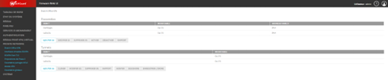

## A.	Le lab avec internet

Maintenant que nous avons tout un ensemble de systèmes et de services configurés sur notre environnement, nous pouvons nous poser les questions suivantes : 
- Comment exposer mes services sur internet pour pouvoir y accéder de partout ?
- Quels services dois-je exposer ou non ? 

Lors de cette partie du cours, nous allons voir quels services sont exposable sur la toile, et comment le faire de manière sécurisée. Nous verrons aussi comment mettre en place un système multisite, afin de connecter votre infrastructure à d'autres environnements comme la maison de vos amis ou parents.

Pour cela, nous allons avoir besoin de plusieurs technologies différentes: 
- Les noms de domaines
- Les certificats
- Les zones DMZ
- Les VPNs

**Point d'attention** : L'exposition de votre infrastructure personnelle sur internet peut être risquée. Des services mal configurés peuvent être cassés par des bots ou des personnes mal intentionnées. Veuillez donc prendre ces informations en compte avant d'exposer vos services, et faites attention aux ouvertures que vous faites sur votre firewall !

## B.	Nom de domaine
### 1.	Présentation

Nous allons commencer par les noms de domaines. Pour cette partie, nous allons malheuresement avoir de nouveau besoin de notre carte bleu.
Avant de commencer, nous allons faire un petit rappel sur les DNS et leurs fonctionnements.

Il existe plusieurs types de serveurs DNS. On y retrouve les serveurs racines, nommés de A à M, et qui sont des serveurs internationnaux. Il n'existe pas de serveur DNS ayant une authorité plus importante que ces serveurs.
Viennent ensuite les serveurs faisant authorité sur un domaine. Ce sont ces serveurs que vous devez joindre pour connaitre les informations de la zone dont ils sont responsables. Dans le cas de `google.com` par exemple, nous retrouvons les célèbres IP 8.8.8.8 et 8.8.4.4.
Pour finir, les serveurs DNS relais ne font pas authorité sur une zone, et servent uniquement de cache pour les hôtes qui se connectent dessus.

Pour obtenir un nom de domaine, nous devons acheter le nom de domaine auprès de `registars`, qui dépendent de la zone DNS de votre choix (fr, com, eu, ...). L'organisme internationnal qui gère les DNS s'appelle ICANN.
Un certain nombre d'entreprises proposent cependant aux utilisateurs l'accès à des noms de domaines, pour les prix allant de moins d'un euro à plusieurs milliers d'euros. En France, on peut retrouver des noms comme IONOS, CLOUDFARE, ou encore OVH.

### 2.	DNS

Choisissez un fournisseur de nom de domaine, et réservez votre propre nom de domaine. **ATTENTION** C'est payant !
Voici quelques fournisseurs : 
- [OVH](https://www.ovhcloud.com/fr/domains/)
- [IONOS](https://www.ionos.fr/domaine/noms-de-domaine)
- [Hostinger](https://www.hostinger.fr/nom-de-domaine-disponible)

Une fois que vous avez fait l'acquisition de votre nom de domaine, rendez-vous sur la page de gestion de nom de domaine de votre fournisseur. Vous obtiendrez une page similaire, récapitulant les informations de nom de domaine et vous permettant de faire des configurations.

Ici vous pouvez voir deux hébergeurs de domaines, IONOS et OVH, et leur interface de configuration de nom de domaines. Vous pourrez ici configurer les entrées DNS ou paramétrer les serveurs DNS pour faire en sorte d'utiliser votre propre serveur en tant que serveur de nom.

### 3.	Certificat SSL

Dans la continuité de l'acquisition d'un nom de domaine et d'un DNS, nous avons la possibilité de créer un site web avec notre nom de domaine. Cependant, afin de nous assurer que notre site web est bien sécurisé, nous devons importer un certificat SSL. Je vous donne donc 2 liens d'acquisition de certificat SSL sur [IONOS](https://www.ionos.fr/assistance/certificats-ssl/configurer-un-certificat-ssl-gere-par-lutilisateur/configuration-dun-certificat-ssl-gere-par-vous-meme-ssl-starter-ssl-starter-wildcard/) et [OVH](https://help.ovhcloud.com/csm/fr-web-hosting-ssl-certificates?id=kb_article_view&sysparm_article=KB0053177).

## C.	DMZ
### 1.	Présentation

Une zone démilitarisée (DMZ) est un sous-réseau séparé du réseau local et séparé d'internet par un pare-feu. C'est le réseau qu'on expose sur internet au lieu d'exposer l'entièreté de notre réseau local, réduisant ainsi les dommages d'une potentielle attaque.

Dans le cas d'un homelab, avoir une DMZ va nous permettre d'exposer nos services sur internet, sans compromettre notre réseau local. On pourrait par exemple pointer sur un reverse proxy, ce qui permettrait d'avoir plusieurs sites web hébergés par notre infrastructure.

Cependant, il est important de souligner que tout service exposé sur internet est soumis à des risques. Il faut donc bien faire attention à ses règles de pare-feu et aux configurations des services que l'on expose.

#### Les architectures de DMZ

Le cas le plus courant de DMZ est une DMZ avec un seul firewall. Dans ce cas, on se retrouve avec 3 zones déclarées. 

Dans le cadre de notre homelab, on se trouve dans ce cas. Le pare-feu correspondrait à notre box, et le serveur à un routeur qui permettrait d'accéder aux différents réseaux que l'on aurait configuré derrière.

Il faut cependant savoir que l'on peut également avoir des DMZ avec plusieurs pare-feux. Cette architecture est plus complexe, et est souvent mise en place dans les grosses entreprises.

Dans le cas des entreprises, le réseau local correspondrait à l'emplacement des serveurs. Pour la partie DMZ, nous retrouverions l'ensemble des relais permettant d'aller sur internet, tels que des proxys ou reverses proxy.

### 2.	Mise en place d’une DMZ

Pour la mise en place d'une DMZ sur notre Homelab, nous allons avoir besoin d'un firewall. Je vous renvoie à la partie de notre cours concernant l'installation de pfSense si vous ne l'avez pas déjà mis en place, ou que vous n'avez pas déjà votre propre firewall.

Rendez-vous ensuite dans les paramètres de votre box, et cherchez l'onglet concernant la gestion de port : 
$

Vous aurez ensuite à activer la DMZ et à spécifier une adresse IP liée à cette DMZ. Cette adresse correspond à l'adresse IP de votre firewall.

Votre DMZ est maintenant configurée. L'ensemble des ports seront redirigés dessus, et vous pourrez faire vos ouvertures de ports pour vos différents services.

## D.	Multisite
### 1.	Présentation
Dans ce module, nous allons voir ensemble le multisite. Le multisite, appelé aussi VPN site à site, est une technologie basée sur du VPN IPsec et permettant de relier des sites distants entre eux de manière sécurisée. L’avantage principal pour une entreprise est de relier ses différents bureaux entre eux, permettant une communication transparente des équipements. Dans le cas d’un homelab, l’utilité du multisite sera principalement orientée sur la redondance de certains services critiques (un serveur mail par exemple), ou la possibilité d’externaliser facilement ses sauvegardes par exemple. Le principal inconvénient d’un système multisite relève de la sécurité. En effet, une liaison mal configurée pourrait être une porte d’entrée pour de potentiels individus malveillants et/ou pourrait faciliter la propagation d’une attaque à d’autres sites. 

Pour monter votre système multisite, la meilleure solution est de faire appel à une personne de confiance qui possède déjà son propre homelab. Ainsi, vous bénéficierez de son infrastructure et lui de la vôtre ; les coûts seront alors réduits et toutes les parties seront gagnantes. 

Une autre solution est de faire appel à un membre de votre famille par exemple, qui aurait la gentillesse de bien vouloir héberger une partie de votre système chez lui. Assurez-vous dans ce cas de choisir du matériel peu gourmand en électricité et en ressources réseau, assez compact et peu bruyant. Rare seront les personnes (qui plus est, non informaticiennes) qui accepteront un système encombrant, bruyant, qui plombe la facture d’électricité et qui les réduit de manière notables les performances de leur réseau. Vous pouvez également proposer à l’intéressé de profiter de vos services (stocker leurs photos importantes qu’ils n’ont jamais sauvegardées par exemple) dans votre négociation. 

Dans ces deux cas, essayez de vous mettre d’accord sur certaines règles afin de limiter au maximum l’impact de votre installation sur le mode de vie de votre hôte (en faisant passer des transferts de fichiers lourds (comme des sauvegardes) en période d’absence ou la nuit par exemple) 

Enfin, si aucune de ces solutions ne s’offre à vous, vous pouvez toujours vous diriger vers une solution cloud, mais qui s’éloignerait quelque peu de l’esprit du homelab même si elle resterait viable.

### 2.	Mise en place
Dans notre cours, nous allons nous baser sur des pare-feux WatchGuard dont nous avons déjà traité dans notre section sur les pare-feux, et plus particulièrement sur de Firebox tabletop. 

Pour commencer, nous nous rendons dans la section réseau privé VPN (virtual private network), puis Branch Office VPN. Dans mon cas, nous pouvons constater que deux VPN sont déjà configurés : il s’agit des boitiers des autres professeurs. Dans la section passerelles, nous cliquons sur ajouter afin de configurer une nouvelle liaison.

Dans la nouvelle page qui s’affiche, nous pouvons nommer notre passerelle afin de l’identifier facilement, puis préciser si la liaison utilisera l’IPv4 ou l’IPv6. Dans une deuxième partie, l’interface nous offre le choix entre une identification basée sur une clé pré-partagée (en caractères ASCII ou hexadécimaux) ou sur un certificat IPsec. Dans notre cas, nous utilisons une clé ASCII de 48 caractères pour sécuriser notre liaison, mais vous pouvez choisir l’option qui vous convient. Nous pouvons ensuite renseigner les adresses des boitiers servants au montage de la liaison IPsec en cliquant sur ajouter. Le premier onglet doit renseigner les informations du boitier sur lequel vous êtes connectés, l’IP publique de la box auquel votre Firebox est connecté par exemple. Dans le cas où vous auriez configuré plusieurs interfaces externes, n’oubliez pas de sélectionner la bonne interface. 

Vous avez plusieurs possibilités qui s’offrent à vous pour identifier la passerelle distante : par adresse IP (l’adresse publique de votre box par exemple), par nom de domaine (utile dans le cas d’un DynDNS par exemple), par ID d’utilisateur domaine, ou encore par nom X500.

Nous passons ensuite au deuxième onglet, ou il vous faudra renseigner les informations du boitier distant. Encore une fois, plusieurs options s’offrent à vous en fonction de la configuration de votre infrastructure et du niveau de sécurité désiré.

Enfin, l’onglet avancé vous permet de spécifier une clé pré-partagée différente sur chaque passerelle, ou encore d’activer bit DF ou PTMU. Nous laisserons toutes ces options dans leur configuration par défaut. Nous passons ensuite sur le second onglet de notre menu, afin de préciser les paramètres de phase 1 de notre VPN. Dans notre cas, nous décidons de passer en IKEv2 et nous enregistrons.

Nous passons ensuite à l’ajout du tunnel en cliquant sur le bouton ajouter de la section éponyme. Encore une fois, nous renommons le tunnel pour faciliter son identification, puis nous précisons la passerelle que nous souhaitons utiliser (dans notre cas, celle que nous venons de créer). Nous ajoutons ensuite une route au moyen du bouton ajouter. 

Dans le menu qui s’affiche, nous pouvons sélectionner une IP d’hôte, une plage réseau, un réseau entier, ou toutes les IP sans distinction pour notre boitier local ainsi que pour le distant. Nous pouvons également préciser si nous souhaitons que le tunnel soit bidirectionnel ou non (et son sens le cas échéant). Nous pouvons également préciser des paramètres de NAT supplémentaires dans le deuxième onglet, mais nous n’en avons pas besoin dans notre cas.

Si votre VPN doit faire passer plusieurs réseaux, vous pouvez les préciser en répétant l’opération. 

Nous laissons la case “Ajouter ce tunnel aux stratégies d’autorisation BOVPN” cochée afin de ne pas rencontrer de soucis avec le pare-feu, et nous passons au second onglet. 

Nous retrouvons de nouvelles options telles que la possibilité d’activer le perfect forward secrecy ou non (et spécifier le groupe DH si c’est le cas), ou le type de chiffrement utilisé. Plusieurs choix sont spécifiables pour cette dernière option, le plus haut étant prioritaire sur le suivant dans la liste. 

Enfin, nous pouvons spécifier des paramètres de multidiffusion auxquels nous ne toucherons pas, puis nous validons en cliquant sur enregistrer. Vous pouvez ensuite renouveler les mêmes opérations sur votre deuxième pare-feu, en n’oubliant pas de changer et/ou inverser les valeurs nécessaires. 

Une fois les opérations réalisées de l’autre côté, nous pouvons réaliser un ping du pare-feu distant pour contrôler notre travail (attention à ne pas avoir de règle de pare-feu empêchant la réponse ping d’un côté ou de l’autre). 

Note : si besoin, est possible de monitorer les connexions, récolter des logs ou de renouveler la clé des tunnels dans le menu état du système, Statistiques VPN et dans l’onglet Branch Office VPN. 
 

 
Félicitations, vous êtes désormais prêts à faire passer votre infrastructure au niveau supérieure grâce au multisite ! 