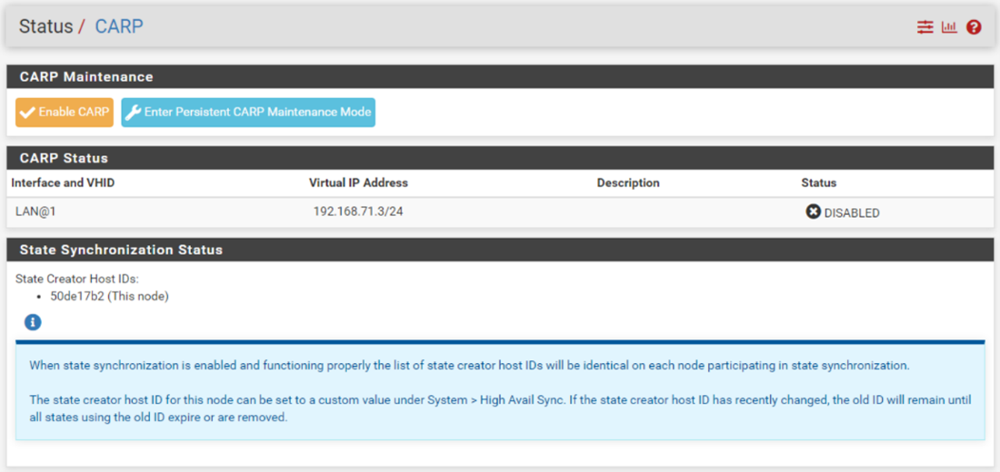
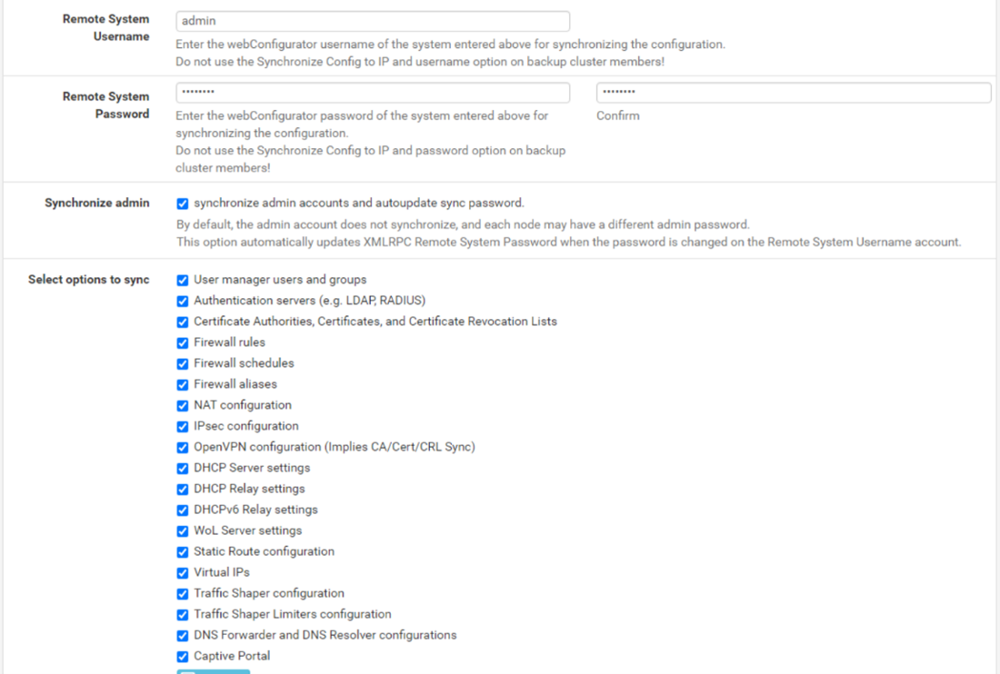

## A. - Les technologies présentées

Lors de cette partie du cours, nous allons vous présenter les différents systèmes que nous avons choisi d’installer sur notre HomeLab.

Pour chaque technologie que nous allons présenter, le cours sera en deux parties : une partie théorique qui présentera le système global via une technologie associée, et une seconde sur l’installation et la configuration de cette technologie sur notre infrastructure. Comme nous ne vous présentons qu’un des différents chemins que vous pouvez emprunter, chaque catégorie aura des recommandations supplémentaires vers d’autres technologies avec les liens vers les documentations afin que vous puissiez aussi trouver des solutions qui vous conviennent par vous-même.

Nous allons donc vous présenter : 

- La virtualisation via : 
  - Les hyperviseurs
  - Les superviseurs
  - L'environnement Docker

- Le stockage via : 
  - Les NAS
  - Les SANs

- Les services contribuants au bon fonctionnement de l’infrastructure : 
  - Firewall (physique ou logiciel)
  - Les VPN
  - Les outils DevOps
  - Le monitoring
    - Grafana
    - Prometheus
    - UptimeKuma

- Un dashboard de centralisation : 
  - Homer

Maintenant que vous avez une idée globale  de ce que nous allons faire dans ce cours, armez-vous de patience, de vos claviers, et suivez-nous dans l’élaboration de votre premier homelab !

## B. - La virtualisation

### 1. - Présentation
Comme vous avez pu le voir dans notre partie Rappel, la virtualisation est un point important, voir central, dans l’informatique moderne. Il est donc nécessaire de comprendre les concepts de la virtualisation et de les mettre en place dans notre homelab.
Nous allons voir ensemble l'installation d'un hyperviseur et sa configuration. Dans la même lancée, nous installerons un système de conteneurisation pour installer certains de nos services sous format docker.

Avant de commencer, il est important de comprendre ce que vous voulez faire avec vos conteneurs ou vos machines virtuelles. Un certain nombre de services proposent des conteneurs déjà presque entierement configurés, et c'est l'un des gros avantages de cette technologie. Cependant, dans un but d'apprentissage, il est parfois interessant d'installer les services manuellement sur une machine virtuelle, ou de monter sa propre image de conteneur pour comprendre comment ces services fonctionnent.

Pour ce cours, nous avons choisi de vous présenter l'hyperviseur Proxmox et le système de conteneurisation docker.
Nous porterons notre attention sur différents points : 

- L'installation de notre Proxmox et de notre environnement docker.
- La configuration basique de notre Proxmox :
    - Configuration du stockage
    - Configuration d'utilisateurs/groupes et gestion des droits associés à ces comptes/groupes
    - Configuration du/des réseaux
    - Création de machines virtuelles
- Les bonnes pratiques en termes de virtualisation :
    - Mise en place de templates
    - Cloud init
    - Connexion via clé SSH

Les prérequis pour cette partie du cours sont : 
- Un ordinateur avec une connexion internet
- Une clé usb 8go
- Notre machine qui deviendra le serveur. Il sera donc nécessaire d'avoir effectué les manipulations présentées dans la section `Hardware`.

Concernant la machine serveur :
- CPU : Il est indispensable d'avoir un processeur mutlicoeurs supportant la virtualisation. Pour le nombre de coeurs, il en faut au minimum 2, même si cela ne vous permettra pas de tout faire. La configuration optimale serait d'avoir un processeur 4 coeurs ou plus.
- RAM : Le minimum requis en terme de mémoire RAM est de 2go. Cependant, comme pour le CPU, vous ne pourrez pas faire grand chose avec aussi peu de ressources, et certains OS ne pourront pas être installés par manque de RAM (exemple: Windows Server qui demande 4go de RAM minimum). Je vous conseillerai de partir sur du 4go au minimum, même si 8Go sont recommandés pour avoir un peu de marge.
- Stockage : Il est recommandé d'avoir plusieurs disques, dont un petit (entre 128 et 256 go) que nous utiliserons pour installer l'OS Proxmox, et un second, plus gros, qui servira de stockage pour les disques des machines virtuelles.
- Réseau : Il faut obligatoirement une carte réseau pour permettre à vos machines d'avoir accès à internet. Il est également recommandé d'avoir une interface Gigabit.

### 2. - Installation de l’hyperviseur

Les prérequis pour cette partie du cours sont : 
- Un ordinateur avec une connexion internet
- Une clé usb 8Go
- Notre machine qui deviendra le serveur

Pour l'installation de notre Proxmox, nous allons commencer par télécharger sur notre ordinateur l'ISO de Proxmox et Rufus, un utilitaire pour intaller l'ISO sur une clé usb bootable.
- [Proxmox](https://enterprise.proxmox.com/iso/proxmox-ve_8.1-1.iso)
- [Rufus](https://github.com/pbatard/rufus/releases/download/v4.3/rufus-4.3.exe)

Une fois ces deux éléments téléchargés, lancez l'éxécutable Rufus et sélectionnez votre clé USB dans l'onglet `device`. 
**Point d'attention** si vous avez plusieurs disques ou clés USB connectés sur votre ordinateur : l'opération procédera à un formatage, et mènera donc à la perte de l'ensemble des données présentes sur cette clé.
Vous pouvez ensuite spécifier l'ISO de Proxmox dans l'onglet `Boot selection`.
Une fois que vous avez sélectionné ces deux paramètres, vous pouvez laisser le reste par défaut et cliquer sur `Start`


Une fois que votre clé USB bootable est prête à l'emploi, vous pouvez la brancher sur votre serveur et vous rendre dans le bios afin de booter dessus.
Une fois que vous avez booté sur la clé, vous arrivez sur l'interface d'installation de Proxmox ! 
**Point d'attention** : Le processus ci-dessus est le même pour toutes les versions de Proxmox. Seules les configurations ultérieures à l'installation changeront en fonction de la version que vous avez installé.

A ce point là, cliquez simplement sur `Install Proxmox VE` :


Acceptez ensuite le contrat de license (EULA) : 


Nous devons ensuite sélectionner le disque sur lequel nous allons installer l'OS. Nous configurerons le stockage des VMs plus tard, lorsque l'OS sera installé.


On s'occupe ensuite de la sélection du pays, qui permet de determiner le layout du clavier et la zone de temps.


On configure ensuite le mot de passe de l'utilisateur **root**, ainsi qu'une adresse email.
**Point important** : Le clavier de base de l'installateur peut être en QWERTY. Vérifiez donc bien quand vous écrivez !


La configuration réseau se fait par rapport à votre réseau personnel. En règle générale, vous serez sur la plage d'ip 192.168.0.0/24 ou 192.168.1.0/24, avec comme passerelle/DNS l'adresse ip de votre routeur.
Vous pouvez retrouver ces informations sur votre ordinateur, en tapant la commande `ipconfig /all`.
Entrez l'adresse IP que vous avez choisi pour votre serveur, puis validez.


Proxmox vous fera ensuite un récapitualitif de vos configurations. En cas d'erreur, vous pouvez cliquer sur `previous`, et venir changer les paramètres sur lesquels vous vous êtes trompés.


L'installation commence, et au bout de quelques minutes vous arrivez sur une page contenant le lien de l'interface web de votre proxmox : 


Vous pouvez désormais accéder à votre interface web depuis ce lien sur votre navigateur : 
```
https://<ip_serveur>:8006
```

Vous pouvez vous connecter avec l'utilisateur **root** et le mot de passe que vous avez défini lors de l'installation, dans le REALM `Linux PAM standard authentification`.


**Point d'attention** : Vous retrouverez sous Proxmox deux manières d'authentification, que l'on appelle REALM.
- PAM : C'est le module d'authentification utilisé par Linux et les systèmes UNIX et BSD. Les informations de l'utilisateur local sont stockées dans le système et permettent l'authentification sur la machine en SSH ou en local, ainsi que sur l'interface de Proxmox.
- PVE : C'est la base de données de proxmox. Elle ne permettra que l'utilisation de l'interface web à ses utilisateurs, ainsi qu'à l'API.


### 3. - Configuration et prise en main du Promox

Vous avez maintenant installé votre Proxmox et nous allons voir comment le prendre en main. Avant de commencer, je vous conseille de faire un tour de l'interface, afin de vous familiariser avec cette dernière.

Vous allez maintenant devoir effectuer plusieurs manipulations sur votre nouvel environnement pour le configurer.

Vous allez devoir réaliser les opérations suivantes sur votre infrastructure : 
- La configuration du réseau (port, sous-réseau...)
- La configuration du stockage
- La configuration des utilisateurs/groupes
- La gestion des droits
- La Gestions des VM
    - Gestion des pools
    - Creation des vms linux et windows
    - Gestion des vms
- Mise en place de templates pour vos futures VM


Nous verons certaines parties ci-dessus, et vous aurez une partie avec un exercice pour la mise en place d'un template pour vos VM.

#### Tour du propriétaire


Après votre première connexion, vous aurez ce genre d'interface.<br>
A gauche, vous retrouverez la liste des VM, des pools et du stockage. Un peu plus au centre, vous retrouverez une liste d'onglets. Nous en verrons certains plus tard dans le cours. <br>
Enfin, au centre, vous trouverez quelques métriques sur les ressources consommées, le nombres de machines, l'état du cluster proxmox etc.<br>
Pour finir, en bas, vous aurez un historique de toutes les taches et des logs.

#### Configuration des réseaux

Pour commencer, vous allez devoir configurer les interfaces réseaux de votre serveur. 

Pour configurer vos interfaces réseau, vous devez vous rendre dans le menu serveur>System>Network :


Dans ce menu, on retrouve la liste de nos différentes interfaces physiques, nommées `eno`, avec un chiffre correspondant au numéro de l'interface. <br>
On trouve aussi une interface nommée ``vmbr0``. C'est une interface bridge, c'est-à-dire une interface virtuelle qui va connecter toutes les interfaces reliées à ce bridge (virtuelles ou physiques) sur le même réseau. Par exemple, sur la capture ci-dessus, ``vmbr0`` est l'interface virtuelle créée par défaut pour permettre à vos machine de se connecter à internet, en passant par l'interface physique `eno1`.

Pour appliquer votre configuration, vous pouvez passer directement depuis l'interface en appuyant sur le bouton `Create`. Vous retrouverez plusieurs types d'interfaces possible : 
- Linux : concerne les interfaces par défaut de Linux
- OVS : c'est un système de switch, qui est une alternative au système linux natif. Nous ne l'utiliserons pas, mais voici la page de documentation de cette partie : `https://pve.proxmox.com/wiki/Open_vSwitch`

Dans ces deux groupes d'interfaces, vous retrouverez :
- Bridge : Une interface bridge permet d'attribuer d'autre interfaces à cette même interface. On pourra donc faire des réseaux de VMs via cette interface.

- Bond : Une interface bond permet de faire du LCAP. C'est une méthode qui permet de regrouper plusieurs interfaces physiques pour faire une seule interface logique. Cela ne sera pas utile dans notre cas.
- VLAN : Permet de faire de la gestion de VLAN.

Vous pouvez aussi passer par la configuration en ligne de commandes, dans le fichier `/etc/network/interfaces`.

Ici, nous allons nous concentrer sur la création d'interface bridge.


Vous aurez la possibilité de nommer vos interfaces, et d'y appliquer des commentaires. Cela nous servira pour bien définir l'utilisation de chaque interface et ne pas se perdre lors de nos configurations futures.<br>
Toutes la partie configuration d'adresses IP n'est pas obligatoire, mais permet d'attribuer une adresse IP à une interface lorsqu'elle est attachée à un port. Attention à la passerelle par défaut, il ne peut pas y en avoir plusieurs sur une seule interface.<br>
La partie `bridge port` permet de définir sur quel port physique l'interface virtuelle sera rattachée.

Pour plus d'informations, vous pouvez aller voir la documentation officielle : https://pve.proxmox.com/wiki/Network_Configuration


#### Configuration du stockage

Nous allons ensuite avoir besoin de stockage pour mettre nos VM en place.

Pour commencer, nous allons voir la configuration du stockage local de votre serveur.<br>
Vous retrouverez dans l'onglet ``disks`` la liste des disques disponibles sur le serveur. Cela vous permettra d'intégrer vos disques et de vérifier qu'ils aient bien été récupérés par Proxmox.


Nous allons maintenant pouvoir configurer nos disques selon 4 formats différents : 
- LVM : volumes LVM
- LVM-Thin : pool de volumes LVM
- Directory : dossier local
- ZFS : système mélangeant le Directory et le LVM

Pour plus d'informations sur les types de stockage, nous vous invitons à visiter la documentation officielle, ou consulter les liens suivants : ``https://votre_serveur/pve-docs/chapter-sysadmin.html#chapter_lvm``.

Ici, nous allons mettre en place des volumes LVM. Allez dans l'onglet `LVM`. Vous retrouverez dans cet onglet la liste des disques LVM déjà configurés. Cliquez sur le bouton `Create: Volume Group` pour créer votre volume.<br>


Selectionnez le disque souhaité dans la liste, ainsi que le nom souhaité.<br>


Une fois votre volume créé, vous allez pouvoir aller dans la configuration `Datacenter`. Dans l'onglet `Storage`, vous pouvez ajouter plusieurs types de stockage différents, comme les stockages locaux que nous avons vu précédement dans la gestion des disques, ou des disques distants avec des protocoles tels que ISCSI ou NFS. ([iscsi](https://doc.ubuntu-fr.org/iscsi) et [nfs](https://doc.ubuntu-fr.org/nfs))<br>
Pour ajouter un disque, cliquez sur le bouton `add` :


Nous pouvons maintenant utiliser notre stockage.

#### Configuration des utilisateurs/groupes

Pour suivre les bonnes pratiques générales en informatique, nous allons créer des comptes qui auront des accès limités aux ressources de nos machines. Cela permet par exemple de donner des accès à vos amis, sans qu'il puissent avoir accès aux ressources déjà mises en place.

Pour gérer les utilisateurs et leurs droits, vous pouvez vous rendre dans l'onglet `Permissions`.<br>


Vous retrouverez dans cet onglet plusieurs onglets : 
- Permissions : cliquer sur l'onglet en lui même permet d'accéder à la gestion des permissions.
- Users : gestion des utilisateurs
- API tokens : permettent de créer des tokens d'authentification pour l'api de Proxmox. Cela permet par exemple de faire du Terraform.
- Two factor : gestion de la double authentification
- Groups : gestion des groupes
- Pools : permet de créer des pools de ressources
- Rôles : gestion des rôles
- realms : permet de gérer les realms, tel que les LDAP, ou PVE par défaut sur Proxmox.

Nous allons commencer par la création d'utilisateurs. Pour cela, rendez vous dans l'onglet `user`, et cliquez sur le bouton `add`.


Vous pouvez ajouter votre utilisateur avec un nom d'identification, le realm choisi (pour les utilisateurs, préférez le Proxmox VE), un groupe et d'autres paramètres supplémentaires.

Nous allons ensuite créer nos pools et nos groupes. Les pools permettront de classer les machines virtuelles et les groupes utilisateurs. Pour cela, rendez vous simplement dans les onglets correspondants, et cliquez sur le bouton `create`.

Pour attribuer un groupe à un utilisateur, sélectionnez votre utilisateur et cliquez sur `Edit`. Vous aurez alors une liste déroulante des groupes. Si vous voulez attribuer plusieurs groupes, vous pouvez simplement en selectionner plusieurs en cliquant sur les groupes les uns après les autres.


Nous verrons l'attribution des pools créés dans la partie suivante, sur la gestion des machines virtuelles.

Nous passons ensuite à la gestion des autorisations. Pour cela, nous utiliserons les rôles par défaut. Vous pouvez cependant en créer d'autres, plus proches de vos demandes, dans l'onglet `roles` et grâce à la documentation ``https://votre_serveur/pve-docs/chapter-pveum.html``.

Pour configurer les permissions, cliquez directement sur l'onglet ``permissions``. Vous pourrez ajouter 3 types de permissions : 
- Les permissions sur les utilisateurs
- Les permissions sur les groupes
- Les permissions sur les tokens API

Nous vous conseillons de gérer les autorisations par groupes, cela permet d'appliquer des configurations complexes sur plusieurs utilisateurs.

La gestion des droits se fait via un système d'asborescence : 


Ici, vous pourrez spécifier de manière précise sur quelle partie les droits vont être mis en place. A savoir : les sous éléments peuvent hériter des droits de leur dossier père. Vous pouvez ensuite appliquer le ou les groupes souhaités, ainsi que le rôle.

Pour la gestion des rôles, veuillez consulter la description des rôles et des permissions associés dans la documentation officielle, partie `Permission Management` : `https://pve.proxmox.com/wiki/User_Management`.

#### Gestion des VMs

Si nous avons installé un proxmox, c'est pour pouvoir y mettre des machines virtuelles. Nous allons donc commencer par créer une machine virtuelle. Nous nous occuperons de la gestion des VM principalement depuis l'interface web, mais vous pouvez aussi le faire depuis l'interface en ligne de commande, que nous ne verrons pas ici. Pour la gestion via ligne de commande, vous pouvez regarder la commande `qm`, avec la commande ``man qm``.

Pour créer votre première machine virtuelle, vous pouvez cliquer sur le bouton `Create VM` en haut à droite de votre écran. Une nouvelle page s'ouvre pour permettre la configuration de la VM. Cliquez directement sur la case `Advanced` pour voir l'ensemble des informations customisables.


Voici les informations que vous allez pouvoir modifier sur l'onglet général : 
- Le Node : la machine physique sur laquel la VM sera hébergée
- Le VM ID : l'identifiant de la machine virtuelle.
- Le nom : le nom de votre VM
- Ressources pool : permet de placer la machine dans un pool, que vous avez pu créé dans les parties précédentes.
- Start at boot : permet de lancer la VM au lancement de la machine physique, dans le cas d'un redémarrage par exemple.
- Tags : permet de mettre en place des tags. Ceux-ci sont purement visuels, mais vous permettent de vous organiser dans vos VM.


Dans la partie OS, vous pouvez :
- Utiliser un fichier ISO : la première option permet d'utiliser les images ISO préalablement installées sur votre Proxmox. Vous devrez aussi selectionner le type et la version de l'OS que vous voulez installer.
- CD physique : la seconde option permet d'installer votre VM via un disque physique inséré dans un lecteur du serveur.
- Ne pas mettre d'OS.


Dans la partie système, vous allez pouvoir configurer : 
- La carte graphique : vous pouvez configurer plusieurs types de cartes graphiques, utilisées pour la prévisualisation.
- Le paramètre machine : permet de définir le chipset. La principale différence entre le i440fs et le q35 est le support du PCI-E, donc la gestion des cartes graphiques par exemple. Vous pouvez laisser ce paramètre par défaut ci besoin est.
- Firmware bios : permet de définir le bios que vous allez utiliser. Vous pouvez généralement utiliser le paramètres par défaut SeaBIOS, ou mettre en place l'UEFI, pour des VM Windows par exemple.
- SCSI Controller : permet de configurer le bus pour les disques durs. Je vous conseille d'utiliser les paramètres `Virtio`, qui permettent d'avoir des performances intéressantes sur des systèmes de virtualisation Linux.
- Qemu agent : permet à Proxmox de récupérer des informations sur la machine virtuelle, comme sa consommation ou son adresse IP.
- Add TPM : permet d'ajouter une puce TPM à notre VM, pour une VM Windows 11 par exemple.


Pour la gestion de vos disques dans la VM, vous pouvez créer un disque virtuel sur lequel votre système tournera. Les options suivantes sont disponibles : 
- Bus/device : selectionner un type de bus. Nous vous conseillons de rester sur le paramètre par défaut.
- Storage : permet de définir sur quel stockage vous aller placer le disque virtuel de votre machine. Je vous rappelle que la configuration de ce stockage a été fait en début de ce cours.
- Disk size : permet de définir la taille en Giga de votre disque virtuel.<br>
- Cache : permet de définir le fonctionnement du cache de ce disque.
- SSD emulation : permet de simuler un SSD. Ce paramètre n'est pas utile, hormis si vous voulez que votre machine virtuelle perçoive ce disque comme étant un SSD.
- Read-only : le disque virtuel que vous créez ne permettra pas l'écriture. A proscrire dans le cas d'une installation de machine virtuelle.
- IO thread et Async IO : permet de configurer le nombre de threads utilisés par IO. Activer ces paramètres permet de meilleures performances.
- Dans l'onglet bandwith, vous pouvez configurer des limites d'écriture et de lecture sur votre disque. Par défaut, tous les paramètres sont illimités.


Dans la partie CPU, vous allez avoir la possibilité de configurer : 
- Le nombre de socket : le nombre de processeurs contenus dans votre VM
- Le nombre de cores : le nombre de coeurs par socket 
- Le type de processeur : cette partie est extrêmement complexe. Elle permet de configurer le type d'architecture de processeur que vous souhaitez utiliser, mais bon nombre de ces architectures, souvent provenant de QEMU, ne sont pas très bien documentées. Je vous recommande donc de laisser par le réglage par défaut, ou d'utiliser le profil `host`, qui utilisera les informations de la machine hôte, et permet souvent de meilleures performances.


Dans la partie memory, vous allez pouvoir configurer la quantité de mémoire RAM de votre machine. Le paramètre ``memory`` représente la valeur maximale utilisable par la VM, tandis que ``minimum memory`` permet d'allouer la quantité minimale de mémoire RAM que la machine peut utiliser.


Dans la partie network, vous allez pouvoir configurer : 
- Le bridge utilisé : il s'agit de l'interface bridge, que nous avons vu dans la configuration réseau et sur laquelle notre VM se connectera pour avoir sa connexion réseau.
- Le modèle : permet de définir le modèle de carte réseau utilisée. Je vous conseille de partir sur du VirtIO.
- VLAN TAG : permet de mettre un tag pour l'utilisation d'un VLAN.
- Firewall : permet d'utiliser le firewall interne de Proxmox
- MAC Address : permet de configurer l'adresse MAC de notre VM
- Disconnect : permet de ne pas connecter votre interface réseau
- Rate limit : permet de placer une limite de débit sur la machine
- MTU : permet de définir le MTU (taille maximum d'un packet pouvant etre transmit sans fragnmantation)

Vous arrivez ensuite sur une page récapitulative, où vous pouvez cliquer sur le bouton `Finish`

Vous retrouverez l'ensemble de vos machines virtuelles dans la liste à gauche de votre écran. Cette liste est modifiable selon 3 templates : server view, folder view et pool view. 


Vous pouvez ici jouer sur plusieurs paramètres de la machine à l'aide d'un clic droit : 
- Mettre en pause la machine
- Eteindre : envoyer un signal pour que le système s'éteigne correctement
- Stopper : équivaut à couper l'allimentation de la VM
- Reboot : relancer la VM
- Clone : faire une réplique de la machine virtuelle
- Convert to template : convertir la machine en template
- Console : lance l'affichage de la VM


En cliquant sur une machine, vous obtenez l'apercu de votre VM ainsi qu'un certain nombre d'onglets pour la configuration de votre machine.


Voici les onglets et leur utilisation : 
- Summary : donne les informations et ressources utilisées par la VM.
- Console : permet de faire apparaitre l'affichage de la VM, ou la console linux.
- Hardware : permet de configurer les composants (CPU, RAM) de votre VM.
- Cloud init : nous verrons cette option plus tard lors d'un TP.
- Options : un ensemble d'options relatives au fonctionnement de la VM.
- Task history : un historique des actions.
- Backup : permet de faire une sauvegarde de votre machine sur un unité de stockage et de faire des restaurations si besoin.
- Réplication : utilisable si vous avez un cluster. Ce n'est pas notre cas, nous ne l'utiliserons donc pas.
- Snapshot : permet de gérer les snapshots.
- Firewall : permet de gérer les règles de part-feu de la machine.
- Permission : gérer les permissions.

Vous retrouverez aussi en haut à droite de l'écran les différentes actions possibles.


Nous avons maintenant fait le tour des choses possibles à faire par rapport à nos VMs. Je vous conseille de pratiquer, de tester les paramètres et de visiter les différents menus pour bien comprendre les différents points.


### 4. - Installation de l’environnement Docker

Avant de nous intéresser à Docker, nous allons définir ce qu'est un conteneur. Un conteneur est un environnement d'exécution léger, permettant d'isoler les applications déployées et de partager les ressources de l'hôte entre les différents conteneurs. Un conteneur est plus léger et plus simple qu’une machine virtuelle et peut donc démarrer et s’arrêter plus rapidement. Il est également plus réactif, et s'adapte mieux aux besoins fluctuants liés au ” scaling ” d’une application.
Docker orchestre, crée et manage ces conteneurs, mais gère aussi dans le partage de ressources, la configuration réseau et stockage des conteneurs.

 

L'installation de notre hyperviseur effectué, nous pouvons installer notre plateforme Docker qui permettra de créer et gérer automatiquement les différentes applications dont nous aurons besoin.
Pour cela, il nous faut créer une VM linux, et nous utiliserons Debian comme distributeur de système d'exploitation.

Une fois l'installation de Linux effectuée, nous nous connectons en SSH sur notre propre machine pour plus de fluidité.
Nous allons dans un premier temps installer le référentiel apt de Docker, qui nous servira de source d'installation et de mise à jour de Docker.

Ajout de la clé GPG officielle de Docker :
```bash
sudo apt-get update
sudo apt-get install ca-certificates curl gnupg
sudo install -m 0755 -d /etc/apt/keyrings
curl -fsSL https://download.docker.com/linux/debian/gpg | sudo gpg --dearmor -o /etc/apt/keyrings/docker.gpg
sudo chmod a+r /etc/apt/keyrings/docker.gpg
```

Ajout du référentiel aux sources APT:
``` bash
echo \
"deb [arch=$(dpkg --print-architecture) signed-by=/etc/apt/keyrings/docker.gpg] https://download.docker.com/linux/debian \
$(. /etc/os-release && echo "$VERSION_CODENAME") stable" | \
sudo tee /etc/apt/sources.list.d/docker.list > /dev/null
sudo apt-get update
```

Et enfin nous allons installer Docker et ces plugins : 
```bash
sudo apt-get install docker-ce docker-ce-cli containerd.io docker-buildx-plugin docker-compose-plugin
```

Pour vérifier que Docker a bien été installé, nous lançons un conteneur test : 
```bash
sudo docker run hello-world
```

L'installation effectuée, nous allons configurer Docker pour qu'il se lance à chaque démarrage système : 
```bash
sudo systemctl enable docker.service
sudo systemctl enable containerd.service
```

Et pour le désactiver, nous pouvons saisir les commandes suivantes :
```bash
sudo systemctl disable docker.service
sudo systemctl disable containerd.service
```
Vous trouverez ici l'anti-sèche des commandes les plus utilisées sur Docker : 
[Cheat Sheet Docker](https://docs.docker.com/get-started/docker_cheatsheet.pdf)

### 5. - Configuration des Dockers

**Gestion des conteneurs**

Nous allons voir 3 concepts clefs de Docker : *les conteneurs, les images et les fichiers Docker (Dockerfile)*

En prenant NGINX comme exemple, voici un tableau avec les commandes les plus utilisées sur Docker pour gérer les conteneurs :

|Commandes|Exemple|Commentaires|
|---|:-:|---|
|**docker run <nom_image>**|`docker run --name some-nginx -v /some/content:/usr/share/nginx/html:ro -d nginx`|Différents arguments peuvent être ajoutés lors de la création du conteneur. Voir [ici](https://docs.docker.com/engine/reference/run/)|
|**docker ps**|`docker ps`|pour lister les conteneurs lancés. Rajouter "-a" comme argument pour lister tous les conteneurs|
|**docker stop <id_conteneur>**|`docker stop 78`|Pour arrêter un conteneur|
|**docker restart <id_conteneur>**|`docker restart 78`|Pour redémarrer un conteneur|
|**docker rm <id_conteneur>**|`docker rm 78`|Pour supprimer un conteneur|


La gestion de conteneur ne nous force pas à créer les conteneurs à chaque fois, un site propose les images Docker les plus utilisées [Docker Hub](https://hub.docker.com/search?q=)

Prenons comme exemple NGINX : serveur web HTTP pouvant servir de proxy inversé, de proxy de messagerie électronique et de LoadBalancer.

Pour l'installer dans notre machine via Dockerhub nous lançons :
```bash
docker pull nginx
```
Et nous attribuons un port externe pour notre hôte local :
```bash
docker run --name some-nginx -d -p 8080:80 some-content-nginx
```

Nous pouvons maintenant accéder à notre serveur local via notre navigateur en saisissant l'adresse : http://localhost:8080

Pour lister les images nous tapons `docker images`
Pour supprimer une image nous lançons la commande `docker rmi <id_image>`

**Compréhension des scripts YAML orienté Docker**

*a) exercice : création de docker compose.yaml pour installer MySQL, Nginx*

### 6. - Pour aller plus loin

**Clustering/HA**

Un des points intéressants avec les systèmes de virtualisation, c'est la possibilité de faire des clusters avec les différentes machines que vous mettez en place. 

Pour faire un cluster, je vous recommande d'aller consulter les liens suivant : 

- [Proxmox Documentation](https://pve.proxmox.com/wiki/Cluster_Manager)
- [Tuto Youtube](https://www.youtube.com/results?search_query=cluster+proxmox)

**Kubernetes**

Si nous souhaitons aller plus loin dans le management et la création de conteneur, nous pouvons installer Kubernetes. Kubernetes est une plate-forme open-source pour gérer les ressources machines (computing), la mise en réseau et l’infrastructure de stockage sur les workloads des utilisateurs.

Vous trouverez donc ci-dessous, différents liens permettant de d'installer et d'utiliser kubernetes : 
- https://kubernetes.io/fr/
    - https://kubernetes.io/fr/docs/concepts/overview/what-is-kubernetes/
- https://docs.k0sproject.io/v1.21.2+k0s.1/
    - https://docs.k0sproject.io/v1.21.2+k0s.1/k0s-in-docker/
- [Playlist Tutoriel Kubernetes](https://www.youtube.com/playlist?list=PLy7NrYWoggjziYQIDorlXjTvvwweTYoNC)

## C. - Le stockage

### 1. - Présentation
Dans tout système de stockage, certaines bonnes pratiques sont à respecter. 

  - Le RAID : 

  La mise en place d’un système en RAID (cf rappel sur les RAID). Votre système de stockage ne peut pas reposer sur un seul élément (un disque dur externe par exemple) ; le risque d’interruption de service en cas de panne serait de 100%. Il vous faut donc choisir un système RAID correspondant à vos besoins en rapidité comme en sécurité/niveau de redondance. 

  - Les sauvegardes : 

Un système de stockage se doit avoir des sauvegardes (et j’insiste ici sur DES sauvegardeS et pas UNE sauvegarde). Encore une fois, tout dépend de la criticité de vos données, mais la règle du 3-2-1 semble être un minimum. Cela consiste en 3 copies de vos données (= 2 sauvegardes, votre prod + 2 copies), sur 2 supports différents (un NAS et une sauvegarde sur bandes par exemple), et une sauvegarde externalisée (par exemple une cartouche RDX, l’objectif étant de ne pas être pris en défaut par un incendie dans votre baie informatique par exemple). La sauvegarde externalisée peut être “à froid” ou juste délocalisée sur un autre site ; mais une sauvegarde à froid peut aussi servir en cas de ransomware. Certaines technologies permettent aussi de créer des sauvegarde “inaltérables”, soit directement grâce à une solution de sauvegarde (Certains produits de chez Veeam par exemple), soit sur le support de sauvegarde (instantané immuable sur NAS Synology par exemple) ; ces fonctions peuvent également être de bonnes solutions pour sécuriser vos données. 

Enfin, point très important : testez vos sauvegardes. Cela peut paraitre bête, mais on ne teste pas ses sauvegardes le jour où l’on en a besoin. Il faut faire des tests de restauration et d’intégrité réguliers pour vérifier tout d’abord que vous saurez utiliser vos sauvegardes si besoin est, mais aussi que vos machines sont sauvegardées convenablement et que les données de sauvegarde ne sont pas corrompues. 

### 2. - Installation de NAS/SAN (TrueNAS)
Ce cours portera sur l’installation et la configuration initiale de TrueNAS. TrueNAS est une solution gratuite et open source, permettant de stocker vos fichiers à la manière d’un NAS mais bien plus encore. Avant d’aller plus loin, il faut savoir que plusieurs versions de TrueNAS existent : TrueNAS core et TrueNAS scale. La version scale est un peu plus puissante et permet offre quelques fonctionnalités supplémentaires comme la possibilité de créer et gérer des conteneurs, offrir de la redondance, etc. Cette dernière est un peu plus adaptée à un environnement d’entreprise ou demandant des ressources de puissance et de stockage importantes (on parle de plusieurs Po), et la version Core nous suffira largement. TrueNAS scale est aussi plus récent que la version core, puisque l’OS est sorti en 2022, tandis que la version core a vu le jour en 2005 (on a donc un bien meilleur recul sur sa fiabilité). 

La version core demande un minimum de 16Go de stockage pour son installation (il en faudra évidemment plus pour stocker les données que vous souhaitez héberger), ainsi qu’un minimum de 8Go de RAM et un processeur 2 cœurs. Il s’agit ici de la configuration recommandée, il est toujorus de faire tourner un système TrueNAS avec moins de RAM par exemple si on se limite à du stockage et partage de fichiers dans un foyer. A l’inverse, augmenter le nombre de fonctions et de plugins portés par votre système vous obligera à augmenter la RAM allouée à votre machine (il est possible de calculer combien de RAM sera nécessaire ici : [Site officiel TrueNAS](https://www.truenas.com/docs/core/gettingstarted/corehardwareguide/))

Nous pouvons donc commencer ce cours en téléchargeant l’image disque de TrueNAS core depuis le site officiel ici : [Télécharger l'ISO](https://www.truenas.com/download-truenas-core/?location=hero)

L’étape suivante est logiquement de passer à l’installation de notre machine. Vous pouvez l’installer en tant que machine physique (le système permet même de supporter des VM si elles restent simples) ou, comme ici, en tant que machine virtuelle.


Une fois notre machine démarrée, nous débutons l’installation. Si vous avez fait le choix de provisionner plusieurs disques dès le début (ou si vous avez fait le choix d’une machine physique), faites attention à sélectionner le bon disque cible pour l’installation.


On suit les différentes étapes de l’installateur, faites attention au type de clavier que vous utilisez lorsque l’on vous demande de choisir un mot de passe : un clavier QWERTY pourrait rendre l’accès à votre machine compliqué par la suite.


L’installation finie, on redémarre notre machine, sans oublier de retirer le support d’installation. Une fois le système démarré, on arrive sur cette interface :


Suivant la configuration de votre HomeLab, il peut être nécessaire de configurer une ou plusieurs interfaces avant de pouvoir se connecter à l’interface web. Vous pouvez aussi vouloir configurer des interfaces en ligne de commande si vous préférez, pour fixer une IP fixe dès le début par exemple. 

Dans notre situation, notre TrueNAS a déjà récupéré une IP depuis notre DHCP, nous pouvons donc d’ores et déjà accéder à l’interface web sans configuration supplémentaire. Il suffit de saisir l’identifiant root et le mot de passe que vous avez configuré lors de la création de la machine (s’il ne correspond pas, pas de panique, il est toujours possible de le réinitialiser via l’interface en ligne de commande de la machine en saisissant l’option numéro 7).


Afin d’éviter de mauvaises manipulations (ou de soulager les moins anglophones d’entre vous), je vous conseille de commencer par changer les options de langue, de clavier et d’emplacement dans System > General


On se rend ensuite dans Stockages > Volumes > Ajouter afin de créer notre partition de stockage. Plusieurs options sont possibles, mais nous allons ici faire au plus simple en choisissant de créer un volume basé sur un seul disque. Nous confirmons notre choix en cliquant sur “Créer un volume”, que l’on nomme ensuite (dans mon cas je l’appellerai “Data”). Dans cette même page, nous avons la possibilité d'activer le chiffrement (plusieurs options sont disponibles, de l’AES-128-CCM à l’AES-256-GCM), que nous n’activerons pas ici. Un autre bouton éveille peut-être aussi votre curiosité : “ajouter vdev”. Sous une apparence compliquée, il s’agit en fait simplement d’une autre unité de stockage (VDEV -> Virtual DEVice) que vous pourriez choisir de créer en vous basant sur un même volume physique. Toujours dans une optique de garder notre machine didactique la plus simple possible, nous choisirons d’allouer tout notre disque à un seul volume de stockage ; puis nous cliquons sur le bouton “créer”. 


Nous avons donc désormais un système opérationnel, et de quoi stocker nos données. Nous allons désormais voire comment créer des utilisateurs afin de remplir tout ce stockage inutilisé. Pour ce faire, nous nous rendons dans Comptes > Utilisateurs > Ajouter. Nous saisissons alors au minimum le nom complet de notre utilisateur, ainsi que son nom d’utilisateur et le mot de passe qui lui sera attribué. Dans les autres options disponibles, nous retrouvons l’ID d’utilisateur (qui doit forcément être supérieur à 1000 dans le cas d’un compte utilisateur), le ou les groupes auxquels on peut ajouter notre utilisateur, ainsi que les permissions que l’on choisit de lui attribuer sur les partages de notre système. On constate également la possibilité de configurer une authentification via clé SSH, de désactiver le compte utilisateur, de l’autoriser à utiliser la commande sudo ou son compte Microsoft (pour l’authentification), et d’utiliser Samba.


Quand tout a été rempli selon notre convenance, nous pouvons cliquer sur le bouton “envoyer” afin de créer notre utilisateur, que l’on voit maintenant au côté de root dans notre liste d’utilisateurs. Libre à vous maintenant d’en créer d’autres, associés à des groupes ou non, afin de compléter et sécuriser votre arborescence de fichiers.


Nous pouvons également créer des partages, SMB par exemple dans le cas d’un utilisateur Windows. Pour cela, nous nous rendons dans Partages > Partages Windows (SMB). On nomme alors notre partage, puis on constate que le bouton “options avancées” nous offre plusieurs fonctions pouvant être utiles. Nous retrouvons entre autres la possibilité de limiter l’accès au partage en lecture seule (via l’option “Exporter en lecture seule”), de choisir les hôtes ayant accès ou ne devant pas accéder au partage (via une liste d’adresses IP par exemple), ou encore de choisir ce lecteur comme dossier personnel de nos utilisateurs. Un dernier menu déroulant nous permet d’autoriser la compatibilité de notre partage avec d’autres protocoles, afin de permettre l’accès via un MAC par exemple.

Votre serveur TrueNAS est désormais totalement opérationnel et bénéficie des fonctions de base d’un NAS. Vous pouvez désormais explorer les autres menus de votre système, parmi lesquels vous retrouverez par exemple : 

    - La possibilité de répliquer vos données (Tâches > Réplication) 

    - Lier votre système à des annuaires (Services d’annuaire) 

    - Permettre à votre système de vous envoyer des notifications via mail (Système > Courriel) 

    - Créer des machines virtuelles hébergées par votre serveur TrueNAS (Machines virtuelles) 

Mais aussi et surtout la possibilité d’installer des plugins sur votre serveur TrueNAS. La collection d’iXsystems vous permet déjà d’ajouter NextCloud à votre système ou de transformer votre système en serveur Plex, mais la communauté offre bien d’autres plugins bien plus nombreux, tels qu’un serveur OpenVPN par exemple, mais aussi des serveurs DNS comme Bind ou des solutions de vidéo surveillance ; le tout appuyé sur une solide communauté. Gardez cependant à l’esprit que toutes ces options demanderont aussi des ressources systèmes, et pourront ralentir votre système et/ou vous obliger à passer sur du matériel plus puissant. 

Vous pouvez désormais faire le choix de vous arrêter ici, ou de compléter votre installation avec NextCloud. NextCloud est un logiciel libre open source permettant d’héberger des fichiers et des fonctionnalités de synchronisation automatique à la manière de TrueNAS, mais elle propose également toute une suite collaborative comprenant notamment :
 
  - Des calendriers partagés 

  - Un gestionnaire de contacts 

  - Un module de conférence vidéo avec partage d’écran 

  - Des visionneuses de documents (PDF, Open Document...) et de fichiers multimédias (jpg, img, mp4...) 

  - Un logiciel de prise de notes 

  - Un client Webmail 

  - Un support d’ActivityPub

Détail important : NextCloud propose une interface plus user-friendly que TrueNAS, notamment avec une application mobile gratuite. Les ministères de l’intérieur et de l’éducation nationale utilisent également NextCloud. 

Pour procéder à l’installation de NextCloud, nous nous rendons dans le menu Plugins, puis nous sélectionnons NextCloud dans la liste et nous cliquons sur installer. Une fois l’installation réussie, nous pouvons au choix cliquer sur le logo NextCloud dans le module Jail des plugins, ou saisir son adresse et son port dans un navigateur. 

Note : les identifiants par défauts se trouvent dans la section “notes post-installation" 


Vous arrivez ensuite sur le tableau de bord de NextCloud. La première chose que nous allons faire est de changer les identifiants qui nous ont été donnés pour le compte administrateur. Pour ce faire, on clique sur l’avatar en haut à droite, puis sur l’onglet Utilisateurs. Dans ce nouveau menu, on retrouve le compte que nous avons utilisé pour nous connecter. Nous cliquons sur le stylo au bout de la ligne, puis nous modifions l’utilisateur (attention, le portail d’authentification demandera toujours l’identifiant ncadmin) et le mot de passe par défaut par ceux de notre choix en cliquant sur la flèche à gauche du champ que nous modifions (il faudra peut-être nous reconnecter après cette opération). Nous retrouvons alors notre ligne utilisateur avec son nouveau nom. 


Depuis ce menu, nous pouvons ajouter d’autres utilisateurs si nécessaire, ou des groupes afin de gérer plus efficacement les stratégies de sécurité que nous souhaiterions mettre en place. 

Nous pouvons désormais nous rendre dans l’onglet fichiers, ou nous pouvons gérer notre arborescence. Certains fichiers sont créés par défaut, et l’on retrouve plusieurs fichiers, notamment un PDF nommé “Nextcloud Manual” qui couvre l’ensemble des fonctionnalités de base de Nextcloud. Le logiciel est très intuitif, mais si certaines questions vous venaient à l’esprit, vous trouveriez votre réponse dans ce fichier (qui comprend également des captures d’écran afin de vous expliquer au mieux).


### 3. - Configuration

### 4. - Pour aller plus loin

## D. - Services

### 1 - Présentation

Maintenant que vous avez installé votre environnement de virtualisation et votre stockage, nous allons pouvoir commencer à installer des services.
Il vous est bien entendu possible d'installer tout types de services sur votre infrastructure, mais voici ce que nous vous recommendons d'avoir : 
- Firewall : Pour connecter vos différents sous réseaux, et pouvoir l'utiliser comme point d'entrée d'une DMZ, par exemple, nous vous recommendons l'utilisations d'un firewall. Nous vous présenterons PFsense, mais il peut etre interessant d'apprendre NFTables ou iptables pour bien comprendre le fonctionnement de ce genre de systeme.
- VPN : Pouvoir se connecter à votre infrastructure peut importe où vous vous trouvez nous semblant indispensable. Nous vous présenterons donc comment faire un VPN avec le célèbre OPENVPN
- Outils DevOps : Savoir utiliser git, et être capable d'automatiser certaines choses redondante, comme l'installation de machines virtuelles, est un point important en informatique, et qui devient de plus en plus rechercher dans le monde professionnel. Nous vous présenterons donc terraform, ansible et git pour vous lancer sur ces sujets.
- Stockage : Nous vous présenterons pour finir un Nextcloud, pour vous présenter une alternative au systeme cloud.

### 2. - Installation/Utilisation du Firewall (pfSense)
pfSense est un système d’exploitation open source basé sur FreeBSD. Il propose des fonctionnalités telles qu’un pare-feu, des VPN, du routage, la gestion du NAT, de VLAN, de protocoles de redondance, des proxys, du DHCP, la prise en charge de DNS dynamiques, un portail captif... La liste est longue ! Il convient tout à fait à des systèmes à la puissance modeste, puisque les spécifications minimums exigées sont un processeur cadencé à 500MHz, 512MB de RAM et 8Go d’espace disque. Il faut évidemment rajouter au moins une carte réseau, voir 2 si l’on veut utiliser la majorité des fonctionnalités (une interface WAN et une LAN par exemple). La configuration minimale devra bien sûr être revue à la hausse si l’on veut maximiser les débits et les fonctionnalités supportés par le système.
La dernière version de pfSense est disponible sur le site officiel via cette adresse : [Télécharger l'ISO](https://www.pfsense.org/download/)

Une fois l’ISO téléchargé, on passe à la création de la machine virtuelle (ou physique!). Pour ce tuto j’utiliserai Hyper-V, mais vous pouvez prendre celui qui vous convient sans problème.


On accepte les conditions d’utilisation, on demande à installer le logiciel et on clique sur suivant


Si votre matériel comporte plusieurs disques ou partitions, apportez un soin particulier à cette partie (l’erreur bête arrive vite, même si l’installeur possède des garde-fous).


La machine demande un reboot pour finir l’installation (selon votre hyperviseur, il faudra peut-être éjecter l’ISO) avant d’afficher cette page :


On retrouve nos interfaces réseau (ici 2, hn0 et hn1), et la console demande si l’on souhaite configurer des VLANs. Pas de panique, nous pourrons toujours changer d’avis plus tard, la réponse n’est pas définitive. 

On nomme nos interfaces, et on confirme notre choix après le résumé des changements demandés. Vient ensuite une nouvelle interface qui offre plusieurs choix. Suivant votre infrastructure, vos interfaces peuvent récupérer une IP ou non. Si la configuration actuelle ne convient pas, il faut se rendre dans le menu n°2 afin de configurer nos interfaces.


Ici par exemple, j’ai demandé à modifier mon interface n°1, puis à utiliser une adresse reçue via DHCP


On peut ensuite configurer notre interface LAN, en configurant un serveur DHCP si besoin pour que nos clients se voient attribuer des adresses IP automatiquement. Dans le cas où vous auriez plusieurs interfaces LAN ou WAN, il suffit de renouveler les opérations précédentes autant de fois que nécessaire.


Maintenant qu’au moins une de nos interfaces LAN est configurée, nous pouvons accéder à l’interface WEB de notre pfSense, qui est bien plus complète. Une fois l’adresse IP du pare-feu tapée sur un navigateur, on saisi les identifiants par défaut afin d’accéder à la configuration web (admin/pfsense). On peut ici donner un nom à notre part feu, ainsi que les serveurs DNS à utiliser.


Les options suivantes ont déjà été configurées dans l’interface en ligne de commande, on peut donc directement passer toute cette configuration jusqu’à arriver à la définition du mot de passe de notre pfSense, puis on quitte le programme d’installation.


Pour vérifier que tout fonctionne correctement, j’attache une machine virtuelle au réseau LAN du pare-feu et je vérifie que tout fonctionne.


Vous avez désormais un pare-feu pfSense à votre disposition. Nous allons maintenant voir quelques applications qu’offre votre nouvelle machine. 

Pour la première application, nous allons voir comment rendre notre système redondant. Plusieurs raisons peuvent motiver ce choix, mais la plus commune est de vouloir se protéger d’un défaut matériel ou d’un dysfonctionnement de la machine qui occasionnerait une coupure internet de notre HomeLab. Libre ensuite à vous de voir à quel point vous voulez pousser la redondance de votre système, on peut par exemple imaginer plusieurs arrivées internet pour renforcer la fiabilité de votre système (attention à ne pas utiliser les mêmes équipements dans vos choix. Par exemple, 2 lignes fibres qui seraient raccordées sur le même boitier au bout de votre couloir d’immeuble n’aurait que peu d’intérêt). 

Pour commencer, il nous faut une deuxième machine. On peut suivre la même procédure d'installation que pour la première, mais il faut quand même faire attention à quelques détails, pour ne pas avoir deux fois la même IP par exemple. On rajoute également une interface supplémentaire afin de relier les 2 machines entre elles. Elles pourront ainsi toujours vérifier l’état de l’autre. Dans mon cas, la configuration de mes machines est la suivante : 

Machine n°1 :


Machine n°2 :


Et mon réseau se compose d’un WAN (hn0), un LAN (hn1), et un réseau isolé (hn2) qui ne sert qu’à relier mes deux pares-feux.


Sur l’interface de notre premier pare-feu, on se rend dans le menu Firewall, puis Virtual IP et on clique sur le bouton “add”. Dans ce nouveau menu, on précise le type d’IP virtuelle (CARP dans notre cas), l’interface qui sera concernée par l’IP virtuelle (ici la LAN), une adresse virtuelle (qui ne doit pas être déjà utilisée, attention aussi à ne pas oublier de spécifier le masque en bout de ligne), ainsi qu’un mot de passe d’IP virtuelle. Le reste des paramètres peut être laissé par défaut, celui qui nous intéresse est le “Skew” ou “biais”. Il sera typiquement à 0 pour le pare-feu maitre et à 1 pour l’esclave. Ne pas oublier de cliquer sur “Apply changes” une fois la configuration enregistrée.


On renouvelle l’opération sur le 2ème pare-feu, en gardant la même IP virtuelle et le même mot de passe, mais en changeant le biais à 1 comme vu précédemment, puis on valide à nouveau.


On peut ensuite se rendre dans le menu Status, puis CARP et activer CARP.


On recommence ensuite la même manipulation mais pour créer une IP virtuelle commune sur l’interface WAN comme suit :


On se rend aussi les services, puis dans les options du serveur DHCP afin de modifier la passerelle distribuée par le service, que l’on remplace par notre adresse virtuelle choisie précédemment pour le LAN. Il faut encore une fois valider les changements en haut de la place quand on effectue un changement.


On vient ensuite se rendre dans le menu System, et High Availablility, où l’on vient cocher la case synchronize states qui permettra aux pare-feux d’échanger leurs informations entre eux. On sélectionne également notre interface de communication (ici notre réseau dédié) et on précise l’IP de l’autre pare-feu.


On spécifie ensuite les identifiants de connexion de l’autre pare-feu, puis on coche les cases qui nous intéresse (dans mon cas, toutes).


On renouvelle l’opération sur le pare-feu secondaire (en changeant les IP), mais sans activer la synchronisation de la configuration et donc sans spécifier les identifiants de connexion puisqu'il s’agit d’un pare-feu de secours sur lequel on ne devrait pas faire de changement de configuration. 

Enfin, on créé une règle de pare-feu pour autoriser la libre communication entre les 2 pare-feux sur le réseau qui leur est dédié.


On peut alors constater que notre premier pare-feu est toujours en état Master, mais que le second est passé en Backup.


On peut alors contrôler la bonne marche de notre configuration en mettant hors service notre premier pare-feu (en enregistrant la VM, en coupant la carte réseau, en débranchant le câble Ethernet...). Si le matériel présent derrière vos pare-feux retrouve rapidement accès à internet, c’est plutôt une bonne nouvelle, mais il nous faut aussi vérifier que les pare-feux reprennent leurs états initiaux après avoir remis en ligne notre machine principale (en allant vérifier l’état CARP). Si c’est bien le cas, félicitations : vous avez configuré vos pare-feux avec brio !

*a)	Exercice : Création de la liste des règles pare-feu de base*

### 3. - Installation/Utilisation d’OpenVPN

La création d'un VPN est intéressant pour avoir accès à l'infrasctructure que vous avez installé en tout temps et emplacement. Nous allons aborder deux technique d'installation, une installation traditionnel et avec le cluster Docker.

**Installation manuelle**

Avant tout, vous devez garder en tête le sous réseau que vous attribuez pour les connexions à distance. Ici nous prendrons adresse_ip.

Créez un serveur Linux sous Proxmox avec comme ressources :
|Ressources||
|---|:-:|
|Mémoire RAM|1Go|
|Stockage disque|16Go|

Dans le cadre d'une utilisation basique du VPN pour se connecter au réseau privé du serveur, nous allons installer un script connu pour configurer nos connexions avec nos clients.

Le script est disponible [ici](https://github.com/angristan/openvpn-install) si vous voulez le voir de manière détaillé.

Nous allons taper ces commandes pour installer le script et le rendre exécutable puis le lancer:
```bash
curl -O https://raw.githubusercontent.com/angristan/openvpn-install/master/openvpn-install.sh
chmod +x openvpn-install.sh
./openvpn-install.sh
```

Plusieurs questions vous seront poser pour configurer le serveur OpenVPN. Ensuite, lorsque vous lancerez à nouveau le script, un menu s'affichera pour créer ou modifier des utilisateurs. 

**Installation sous Docker**

Pour cela, nous allons utiliser ce repo : [Repo OpenVPN](https://hub.docker.com/r/kylemanna/openvpn/)

Prenez la main sur le serveur Master de Docker.
Nous allons déterminer le nom du container. Trouvez un suffixe parlant après "ovpn-data"
`OVPN_DATA="ovpn-data-fyc"
`

Nous allons ensuite initialiser le conteneur avec les fichiers de configuration ainsi que les certificats.
```bash
docker volume create --name $OVPN_DATA
docker run -v $OVPN_DATA:/etc/openvpn --rm kylemanna/openvpn ovpn_genconfig -u udp://VPN.SERVERNAME.COM
docker run -v $OVPN_DATA:/etc/openvpn --rm -it kylemanna/openvpn ovpn_initpki
```

Nous allons ensuite :
```bash
# mettre en marche serveur OpenVPN
docker run -v $OVPN_DATA:/etc/openvpn -d -p 1194:1194/udp --cap-add=NET_ADMIN kylemanna/openvpn

# générer un certificat client sans passphrase. N'hésitez pas à changer la variable CLIENTNAME 
docker run -v $OVPN_DATA:/etc/openvpn --rm -it kylemanna/openvpn easyrsa build-client-full CLIENTNAME nopass

# récupérer la configuration client avec les certificats crée précédemment. Changez la variable CLIENTNAME avec celui crée précédemment
docker run -v $OVPN_DATA:/etc/openvpn --rm kylemanna/openvpn ovpn_getclient CLIENTNAME > CLIENTNAME.ovpn
```

Voilà ! Vous venez, de crée un serveur VPN et le 1er client.

**Installation de l'agent client**

Nous avons crée le serveur VPN. Il faut maintenant installer l'agent sur la machine client pour pouvoir accès à distance à notre serveur.
Nous trouverons l'agent [ici](https://openvpn.net/community-downloads/).

N'oubliez pas de récupérer les informations nécessaires ainsi que les certificats clients pour vos machines.

Après avoir effectué l'installation, vous n'aurez qu'à implanté les informations dans les champs demandés.


### 4. - Installation/Utilisation d’outils DEVOPS
Pour notre environnement DevOps, nous allons voir trois points : 
- Terraform
- Ansible 
- Git

Nous procéderons à la présentation et à l'installation de ces systèmes sur une machine virtuelle, que vous pouvez créer tout de suite. Vous aurez ensuite un TP à faire, pour 
**Terraform**

Terraform est un système d'infrastructure as code. Il permettra donc de créer des vms via des fichiers de configuration terraform.<br>
Voici la documentation officiel de terraform : https://www.terraform.io/<br>
Si vous n'êtes pas d'accord avec l'utilisation de terraform, pour certaines raisons d'orientation d'entreprise, regardez cette documentation d'OpenTofu : https://opentofu.org/docs/

Pour installer Terraform, connectez vous sur la machine devops que vous avez créé au préalable.
On commence par installer les dépendances : 
```bash
# Debian
sudo apt-get update && sudo apt-get install -y gnupg software-properties-common
# RedHat
sudo yum install -y yum-utils
```
On installe ensuite la clé gpg du repo et le repo : 
```bash
# Debian
wget -O- https://apt.releases.hashicorp.com/gpg | gpg --dearmor | sudo tee /usr/share/keyrings/hashicorp-archive-keyring.gpg
echo "deb [signed-by=/usr/share/keyrings/hashicorp-archive-keyring.gpg] https://apt.releases.hashicorp.com $(lsb_release -cs) main" | sudo tee /etc/apt/sources.list.d/hashicorp.list
# RedHat
sudo yum-config-manager --add-repo https://rpm.releases.hashicorp.com/RHEL/hashicorp.repo
```
On fini par installer terraform : 
```bash
# Debian
sudo apt update
sudo apt install -y terraform
# RedHat 
sudo dnf install -y terraform
```

Maintenant que terraform est installé, nous allons pouvoir commencer à l'utiliser.<br>
Commencons donc par créer un dossier ``terraform``, dans lequel nous mettrons l'ensemble de nos projets, puis un dossier `TP-terraform`.
```bash
mkdir -p terraform/TP-terraform && cd terraform/TP-terraform
```
Pour commencer, nous devons créer les différents fichiers terraforms : 
- credentials.rfvars : Nous y mettrons les differents mot de passes et autres. C'est un fichier à bien entendu mettre dans votre git_ignore.
- provider.tf : le provider est le support sur lequel votre terraform va s'executer. Nous allons donc devoir utiliser le provider de proxmox. Voici la liste des providers de terraform : https://registry.terraform.io/browse/providers
- main.tf : c'est ici que la magie opère. Nous allons pouvoir definir les différentes actions à effectuer.

```bash
# Fichier provider.tf
terraform {
    required_version = ">= 0.13.0"
    required_providers {
        proxmox = {
            source = "telmate/proxmox" # On défini la source. Pour nous, proxmox !
        }
    }
}
# On défini les variables
variable "proxmox_api_url" {
    type = string
}
variable "proxmox_api_token_id" {
    type = string
}
variable "proxmox_api_token_secret" {
    type = string
}

provider "proxmox" {
    pm_api_url = var.proxmox_api_url
    pm_api_token_id = var.proxmox_api_token_id
    pm_api_token_secret = var.proxmox_api_token_secret
}
```

Générez sur votre utilisateur et le token depuis votre proxmox, puis remplissez les champs suivant : 
```bash
# Fichier credentials.tfvars
proxmox_api_url = "https://0.0.0.0:8006/api2/json"  # Your Proxmox IP Address
proxmox_api_token_id = "terraform@pam!terraform"  # API Token ID
proxmox_api_token_secret = "your-api-token-secret"
```

Vous créerez votre main.tf dans un TP par la suite.

Concernant les différentes commandes importante : 
```bash
terraform init #permet d'initialiser le projet/telecharger les elements nécessaires pour communiquer avec proxmox

terraform plan -var-file="credentials.tfvars" #Permet d'afficher les changements prévu, sans les appliquer

terraform apply -var-file="credentials.tfvars" #Permet de lancer le terraform, et donc de creer la VM

terraform destroy -var-file="credentials.tfvars" #Permet de supprimer les elements créer par terraform
```

**Ansible**

Ansible est un système de configuration as code. Contrairement à Terraform, Ansible est fait pour configurer des serveurs ou services. Cela combine cependant bien avec Terraform dans la mise en place d'un projet AsCode. Vous allez pouvoir definir des configurations dans des fichiers yaml, et les appliquer à distance et sur plusieurs machines différentes en même temps.<br>
Voici la documentation d'Ansible : https://docs.ansible.com/

Pour installer Ansible, connectez vous sur la machine devops que vous avez créé au préalable.
```bash
# Debian
sudo apt-add-repository ppa:ansible/ansible
sudo apt update
sudo apt install -y ansible
# RedHat 
sudo dnf install -y ansible-core
```

Avant de commencer, nous allons créer sur notre serveur une clé ssh qui permettra à notre ansible de se connecter sur les différents hôtes. Vous pouvez rajouter cette clé à votre template de vm pour permettre à ansible de pouvoir directement se connecter à vos VMs, et faire des actions dessus.

Les fichiers ansible sont des fichiers yaml. On les appelle les playbook.<br>
Pour lancer ces playbooks, il va falloir spécifier les hôtes. On va donc pouvoir configurer un fichier inventory.ini.

Pour tester la connexion vers les différents hôtes : 
```bash
ansible all -i inventory.ini -m ping
```
Voici la liste des paramètres : 
- `all` : toutes les hôtes de l'inventaire
- `-i inventory.ini`: L'inventaire en question
- `-m ping` : On lui demande d'executer la commande ping

On peut aussi lancer des commandes linux : 
```bash
ansible all -i inventory.ini -a "whereis python"
```
Dans le cas où il faudra une élévation de privilège, vous pouvez passer le paramètres `--become`.

Le fichier inventory.ini sera de la forme : 
```yaml
[targets] 
other1.example.com ansible_connection=ssh ansible_ssh_user=user ansible_ssh_private_key_file=/path/to/file
```
Voici la liste des paramètres : 
- `[targets]` : Nom de la target
- `other1.example.com`: ip ou fqdn de la target
- `ansible_connection=ssh` : On definit le type de connexion. Pour windows, cela pourrait etre winrm.
- ``ansible_ssh_user=user`` : on définit l'utilisateur de l'hôte distant
- ``ansible_ssh_private_key_file=/path/to/file`` : on définit la clé ssh pour se connecter dans mot de passe.

Vous créerez des playbooks dans un TP par la suite.

Les commandes pour lancer des playbooks : 
```bash
ansible-playbook -i inventory.ini nom_playbook
```
Voici la liste des paramètres : 
- `-i inventory.ini`: L'inventaire
- `nom_playbook` : Le playbook que vous voulez lancer

**Git**

Git est un logiciel de gestion de versions. Il est intéressant car il permet de stocker des fichiers de configurations ou le code sources d'applications de manière efficace, permettant de gerer les versions des fichiers. Il est aussi très utilisé, vous retrouverez beaucoup d'integration de git dans les logiciles de developpement. De plus, certains dérivé, comme gitlab ou github, permettent d'avoir un ensemble d'outils supplémentaires pour les développeurs, et pour déployer des services de manières automatiques.<br>
Voici la documentation de Git : https://git-scm.com/<br>
Voici la documentation de Gitlab : https://docs.gitlab.com/<br>
Voici la documentation de github : https://docs.github.com/fr<br>

Nous allons commencer par installer git sur notre poste : https://git-scm.com/downloads<br>
Une fois git installer sur votre ordinateur, vous pourrez faire des clones de repos.

De notre côté, nous allons installer gitlab. Votre machine virtuelle aura donc besoin au minimum : 
- 2 coeurs
- 8go de ram

Nous commencerons donc par installer les prérequis : 
```bash
sudo apt update
sudo apt install ca-certificates curl openssh-server postfix perl
```

Pour installer les référentiels maintenus par gitlab, nous allons utiliser un script : 
```bash
cd /tmp
curl -LO https://packages.gitlab.com/install/repositories/gitlab/gitlab-ce/script.deb.sh
sudo bash /tmp/script.deb.sh
```
Nous pouvons maintenant installer gitlab via apt : 
```bash
sudo apt install gitlab-ce
```

Nous allons ensuite editer le fichier de configuration de gitlab : 
```bash
# Vous pouvez utiliser l'éditeur que vous souhaitez
sudo vim /etc/gitlab/gitlab.rb
```

Cherchez le paramètre external_url, et remplissez placez l'url qui sera utiliser pour se connecter sur cette machine. Cela dépends de votre cas. Si vous avez un nom de domaine, vous pouvez l'utiliser.
```bash
external_url 'http://exemple.com:80'
```
Vous pouvez aussi jeter un oeil à la documentation et aux autres paramètres pour configurer votre gitlab comme vous le souhaitez.

Une fois vos paramètres etablis correctement dans le fichier de configuration, nous allons configurer le service : 
```bash
sudo gitlab-ctl reconfigure
```
Cette opération peut prendre plus ou moins de temps en fonction des ressources que vous avez.

Une fois la configuration finalisé, vous pouvez aller sur l'url que vous avez configurer et aller sur votre gitlab. Les identifiants par défaut sont récupérable dans le fichier `/etc/gitlab/initial_root_password`.

Vous pouvez maintenant utiliser votre gitlab, créer des repos et des utilisateurs.

### 5. - Installation/Utilisation de NEXTCLOUD

## E. - Monitorings

### 1. - Présentation

Le monitoring peut être utilisé de différentes manières, mêmes pour un usage personnel. En effet, les habitations possèdent de plus en plus d'objets connectés (caméra de surveillances, luminaires, domotiques, portables, tablettes, ordinateurs, etc.). Un monitoring permettra de recenser les différentes performances qu'utilise un équipement électronique.

Nous utiliserons différentes solutions pour surveiller nos différents équipements : Prometheus et UptimeKuma.
Leur utilisation diffère selon vos besoins.

||Uptime Kuma|Prometheus|
|---|:---:|:---:|
|**Utilisation**|Surveillance de sites web|Surveillance des performances systèmes|
|**Alertes**|Oui|Oui|
|**Facilité de prise en main**|Facile|Medium|
|**Exemple d'utilisation**|Ping sur un site (en cours de développement) pour connaître s'il est en marche ou non|% d'utilisation de la RAM d'un équipement|

### 2. - Installation Prometheus/UptimeKuma (à faire en vidéo)

Dû à leurs complexité de configuration, il est conseillé d'installer ces serveurs sous Docker. 
Voici cependant des liens si vous souhaitez les installer manuellement : [Prometheus](https://linux.how2shout.com/how-to-install-prometheus-in-debian-11-or-ubuntu-20-04/), [Uptime Kuma](https://www.rosehosting.com/blog/how-to-install-uptime-kuma-on-debian-12/).

Nous vous montrerons comment installer Prometheus sous Docker et vous laisserons comme cas pratique, l'installation de l'autre serveur de monitoring.

Lien vers le repo Docker Hub de Prometheus : https://hub.docker.com/r/prom/prometheus/

Prenez la main sur votre serveur Docker en SSH. Tapez ensuite les commandes suivantes:

```bash
mkdir /etc/prometheus
nano /etc/prometheus/prometheus.yml
```

Et entrez ce script :

```yml
# my global config
global:
  scrape_interval: 15s # Set the scrape interval to every 15 seconds. Default is every 1 minute.
  evaluation_interval: 15s # Evaluate rules every 15 seconds. The default is every 1 minute.
  # scrape_timeout is set to the global default (10s).

# Alertmanager configuration
alerting:
  alertmanagers:
    - static_configs:
        - targets:
          # - alertmanager:9093

# Load rules once and periodically evaluate them according to the global 'evaluation_interval'.
rule_files:
  # - "first_rules.yml"
  # - "second_rules.yml"

# A scrape configuration containing exactly one endpoint to scrape:
# Here it's Prometheus itself.
scrape_configs:
  # The job name is added as a label `job=<job_name>` to any timeseries scraped from this config.
  - job_name: "prometheus"

    # metrics_path defaults to '/metrics'
    # scheme defaults to 'http'.

    static_configs:
      - targets: ["localhost:9090"]
```

```bash
# Création du volume pour stocker les données
docker volume create prometheus-data

# Création et mise en marche du docker
docker run -p 9090:9090 -v prometheus-data:/prometheus -v /etc/prometheus/prometheus.yml:/etc/prometheus/prometheus.yml -d prom/prometheus --name prometheus
```
**Installation des agents avec Node Exporter sur les machines virtuelles**

Nous allons maintenant installer l'agent sur les VMs clients pour récolter les données.
Tapez la commande suivante pour installer l'agent sur une VM Debian :
```bash
apt install prometheus-node-exporter
```

Nous retournons maintenant sur le serveur comportant Prometheus et nous modifions le fichier **Prometheus.yml**.

En effet vous avez dans ce fichier, une ligne se nommant *static config* avec *target* soit comportant les adresses IP des cibles pour récupérer leurs données.
Node-exporter utilise le port 9100. Nous allons donc rajouter dans target l'adresse IP de la machine auquel nous avons installé l'agent avec comme port 9100.

A chaque modification du fichier, notamment pour un ajout de cible dans prometheus, nous devons redémarrer le conteneur avec : `docker restart [container_ID]`

**Installation Grafana**

```bash
mkdir /etc/grafana
docker volume create grafana-data
docker run -d -p 3000:3000 --name=grafana -v grafana-data:/etc/grafana grafana/grafana-enterprise
```

*a) exercice : Installation d'Uptime Kuma sous Docker*

### 3. - Configuration

**Configuration Grafana**

Une fois l'installation de Prometheus et des agents effectué, nous allons configuré Grafana afin de récupérer les données de Prometheus et les afficher dans un graphs avec les spécificités que nous souhaitons.

Nous pouvons voir des graphs préconfigurés sur [ce site](https://grafana.com/grafana/dashboards/).

Dans notre exemple nous prendrons [Node Exporter Full](https://grafana.com/grafana/dashboards/1860-node-exporter-full/) que vous pouvez importer dans Grafana. Voici le dashboard affiché. 


**Configuration UptimeKuma**

## F. - Dashboard

### 1. - Présentation

Un tableau de bord permettra donc de voir de manière organisé les différentes données recensé par le monitoring. En effet, un serveur de monitoring s'occupera de recenser les informations que vous aurez programmé mais affichera ces données de manière brute et condensé.
Pour un usage personnel, nous resterons sur des solutions open sources, tel que [Homer](https://github.com/bastienwirtz/homer?ref=tcude.net)

### 2. - Installation Homer

L'installation se fait sous Docker avec les commandes suivantes :

```bash
mkdir /etc/Homer
docker volume create homer-data
docker run -d -p 8080:8080  --name homer -v /etc/Homer:/etc/Homer --restart=always  b4bz/homer:latest
```

*a) exercice : configuration de Homer avec tous les services mis en place*

## G. - Pour aller plus loin

Vous avez maintenant un infrastructure en place fonctionnel. Vous allez pouvoir integrer plus de services, et tester plus de technologies.

Voici quelques technologies que nous vous conseillons de regarder : 
- Virtualisation
    - QEMU/KVM
    - XCP-NG
    - VMware ESXI/Vsphere
- Firewall
    - Iptables
    - NFTables
- Automatisation
    - rundeck
    - foreman
    - 
- Autres
    - Serveur DNS
    - Serveur DHCP
    - Serveur WEB
    - Serveur proxy/reverse proxy

Un homelab est quelque chose qui ouvre des portes pour tous les passionnés d'informatiques, leur permettant de tester des choses, et surtout de les mettres en place ! <br>
Maintenant que vous avez mis en place le coeur de votre homelab, amusez vous et testez tous !