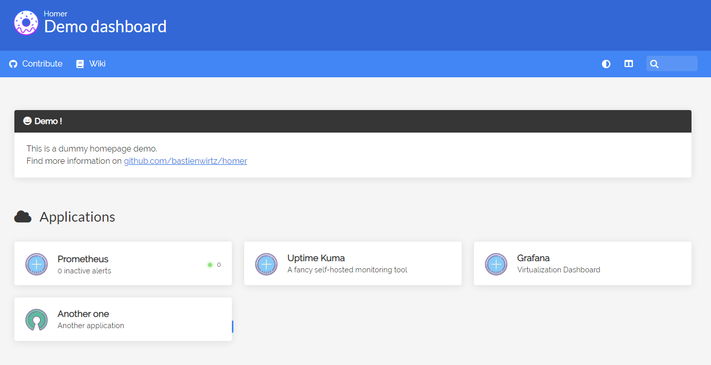

*a)	Exercice : Création de la liste des règles pare-feu de base*

__________________________

*a) exercice : Installation d'Uptime Kuma sous Docker*

Afin de voir si vous avez bien compris le processus d'installation sur Docker, je vous demanderais de me donner le code d'installation ainsi que les commande d'installation comme effectuer avec prometheus.

```bash
mkdir /etc/uptimekuma
nano /etc/uptimekuma/uptimekuma.yml
```

```yml
# Simple docker-compose.yml
# You can change your port or volume location

version: '3.3'

services:
  uptime-kuma:
    image: louislam/uptime-kuma:1
    container_name: uptime-kuma
    volumes:
      - ./uptime-kuma-data:/app/data
    ports:
      - 3001:3001  # <Host Port>:<Container Port>
    restart: always
```
```bash
docker volume create uptime-kuma-data
docker run -d --restart=always -p 3001:3001 -v uptime-kuma-data:/etc/uptimekuma -v /etc/uptimekuma/uptimekuma.yml:/etc/uptimekuma/uptimekuma.yml --name uptime-kuma louislam/uptime-kuma:1
```
________________________________________

*a) exercice : configuration de Homer avec tous les services mis en place*

Maintenant que nous avons installer tous nos services, nous pouvons regrouper les services dans une seule Homepage qu'est Homer.

Vous allez maintenant configurer le config.yml dans le conteneur Homer pour ajouter les liens tel que Proxmox et UptimeKuma.

Voilà une idée de résultat final.


Pour cela, mettez vous en SSH sur le serveur docker et tapez les commandes suivantes :
Vous aurez également besoin de cette anti-sèche pour naviguer sur l'éditeur de texte intégré dans le conteneur qu'est Vi : [Cheat Sheet Vi](https://www.atmos.albany.edu/daes/atmclasses/atm350/vi_cheat_sheet.pdf)
Vous pourrez également vous aider de [ce lien](https://github.com/bastienwirtz/homer/blob/main/docs/customservices.md)

```bash
docker exec -u 0 -it homer sh
vi assets/config.yml
```

Vous trouverez une section *Services* auquel vous modifierez la liste des *items*:

```yml
# Services
# First level array represent a group.
# Leave only a "items" key if not using group (group name, icon & tagstyle are optional, section separation will not be
services:
  - name: "Applications"
    icon: "fas fa-cloud"
    items:
      - name: "Prometheus"
        type: Prometheus
        logo: "assets/tools/prometheus.png"
        url: "http://adresse-ip:9090"
        # subtitle: "Monitor data server"
      - name: "Uptime Kuma"
        logo: "assets/tools/UptimeKuma.png"
        subtitle: "A fancy self-hosted monitoring tool" # optional, if no subtitle is defined, Uptime Kuma incidents, if        
        url: "http://adresse-ip:3001"                                                                                         
        slug: "default" # Defaults to "default" if not provided.                                                                
        type: "UptimeKuma"                                                                                                    
      - name: "Grafana"                                                                                                         
        logo: "assets/tools/Grafana.png"                                                                                         
        subtitle: "Virtualization Dashboard"                                                                                    
        url: "https://adresse-ip:3000"                                                                                                                                                  
```

Votre fichier config.yml devrait ressembler à cela.