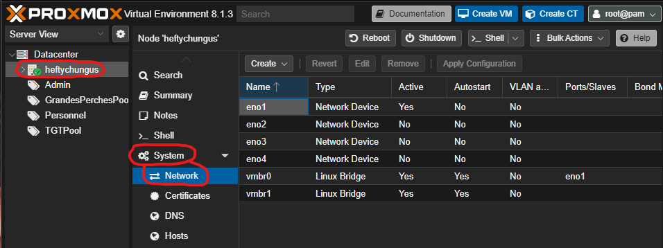

# TP Proxmox

Vous avez maintenant installer votre proxmox. Vous allez donc maintenant apprendre à le prendre en main via ce TP.
Vous allez donc devoir faire plusieurs manipulations sur votre nouvel environnement pour le configurer.

Vous allez devoir faire les points suivant sur votre infrastructure : 
- La configuration du réseau (port, sous-réseau, )
- La configuration du stockage
- La configuration des utilisateurs/groupes
- La gestion des droits
- La Gestions des VM
    - gestion des pools
    - creation des vms linux et windows
    - gestion des vms
- Mise en place de template pour vos futures VMs

## Configuration des réseaux

Pour commencer, vous allez devoir configurer les interfaces réseaux de votre serveur. 

Pour configurer vos interfaces réseau, vous devez aller dans le menu serveur>System>Network :

Dans ce menu, on retrouve la liste de nos différentes interfaces physiques, nommé `eno`, avec un chiffre correspondant aux numéros de l'interface.
On trouve aussi une interface nommé ``vmbr0``. C'est une interface bridge, c'est-à-dire une interface virtuelle qui va connecter toutes les interfaces (virtuelle ou physique) reliés à ce bridge sur le meme réseau. Par exemple sur la capture ci-dessus, ``vmbr0`` est l'interface virtuelle créé par défaut pour permettre à vos machine de se connecter à internet, en passant par l'interface physique `eno1`.
Il est aussi possible de créer d'autre interface bridge, pour permettre d'avoir des sous-réseaux dans notre serveurs.

Pour appliquer votre configuration, vous pouvez passer directement depuis l'interface en appuyant sur le bouton `Create`. Une fois que vous avez fini de créer votre interface, vous devez pensez à appliquer la configuration.
Vous pouvez aussi passer par la configuration en ligne de commandes, dans le fichier `/etc/network/interfaces`.

Pour plus d'informations, vous pouvez aller voir la documentation officiel : https://pve.proxmox.com/wiki/Network_Configuration

Dans notre cas, nous crérons des sous-réseaux que nous interconnecterons via un pfsense, que vous verrez plus tard lors du cours.
Sur votre serveur, créez donc deux sous-réseaux supplémentaire :
- Le réseau projet (Pour mettre vos projets pour les cours par exemple): vmbr1 avec un commentaire "Réseau projet"
- Le réseau privée (Pour mettre vos services) : vmbr2 avec un commentaire "Réseau projet"

## Configuration du stockage
