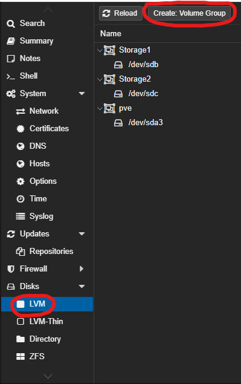
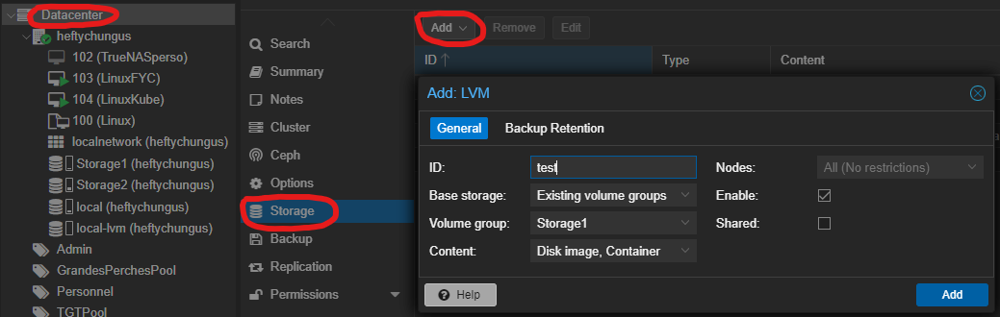
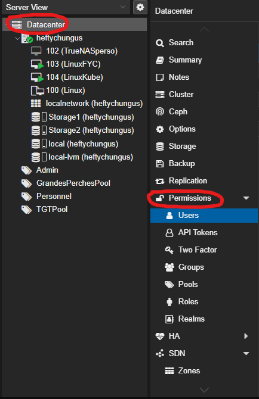
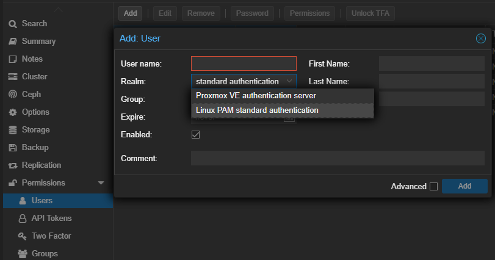
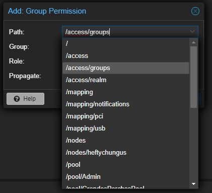

# TP Proxmox

Vous avez maintenant installer votre proxmox. Vous allez donc maintenant apprendre à le prendre en main via ce TP.
Vous allez donc devoir faire plusieurs manipulations sur votre nouvel environnement pour le configurer.

Vous allez devoir faire les points suivant sur votre infrastructure : 
- La configuration du réseau (port, sous-réseau, )
- La configuration du stockage
- La configuration des utilisateurs/groupes
- La gestion des droits
- La Gestions des VM
    - gestion des pools
    - creation des vms linux et windows
    - gestion des vms
- Mise en place de template pour vos futures VMs

## Configuration des réseaux

Pour commencer, vous allez devoir configurer les interfaces réseaux de votre serveur. 

Pour configurer vos interfaces réseau, vous devez aller dans le menu serveur>System>Network :

Dans ce menu, on retrouve la liste de nos différentes interfaces physiques, nommé `eno`, avec un chiffre correspondant aux numéros de l'interface.
On trouve aussi une interface nommé ``vmbr0``. C'est une interface bridge, c'est-à-dire une interface virtuelle qui va connecter toutes les interfaces (virtuelle ou physique) reliés à ce bridge sur le meme réseau. Par exemple sur la capture ci-dessus, ``vmbr0`` est l'interface virtuelle créé par défaut pour permettre à vos machine de se connecter à internet, en passant par l'interface physique `eno1`.
Il est aussi possible de créer d'autre interface bridge, pour permettre d'avoir des sous-réseaux dans notre serveurs.

Pour appliquer votre configuration, vous pouvez passer directement depuis l'interface en appuyant sur le bouton `Create`. Une fois que vous avez fini de créer votre interface, vous devez pensez à appliquer la configuration.
Vous pouvez aussi passer par la configuration en ligne de commandes, dans le fichier `/etc/network/interfaces`.

Pour plus d'informations, vous pouvez aller voir la documentation officiel : https://pve.proxmox.com/wiki/Network_Configuration

Dans notre cas, nous crérons des sous-réseaux que nous interconnecterons via un pfsense, que vous verrez plus tard lors du cours.
Sur votre serveur, créez donc deux sous-réseaux supplémentaire :
- Le réseau projet (Pour mettre vos projets pour les cours par exemple): vmbr1 avec un commentaire : "Réseau projet"
- Le réseau privée (Pour mettre vos services) : vmbr2 avec un commentaire : "Réseau projet" 
Puis, configurer sur l'interface vmbr0 un commentaire : "Réseau box"

## Configuration du stockage

Nous allons avoir besoin ensuite de stockage pour pouvoir mettre nos VMs en place.

Pour commencer, nous allons voir pour les configurations concernant le stockage locale de votre serveur. 
Vous retrouverez dans la configuration de votre serveur, dans l'onglet ``disks``, la liste des disques disponibles sur le serveurs. Cela vous permettra d'integrer vos disques, et de voir qu'ils ont bien été récupérer par proxmox.

Nous allons ensuite pouvoir configurer nos disques selon 4 formats différents : 
- LVM : volumes LVM
- LVM-Thin : pool de volumes lvm
- Directory : dossier local
- ZFS : système qui melange du Directory et du LVM

Pour plus d'information sur les types de stockages, nous vous invitons à visiter la documentations officiel, ou aller sur les liens : ``https://votre_serveur/pve-docs/chapter-sysadmin.html#chapter_lvm``.

Ici, nous allons mettre en place des volumes LVM. Allez dans l'onglet `LVM`. Vous retrouverez dans cet onglet la liste des disques LVM déjà configurer. Cliquez sur le bouton `Create: Volume Group` pour créer votre volume. 

Selectionnez le disque souhaitez dans la liste, ainsi que le nom souhaité. 

Une fois votre volume créé, vous allez pouvoir aller dans la configuration `Datacenter`. Dans l'onglet `Storage`, vous pouvez ajouter plein de type de stockage différent, comme les stockages locaux que nous avons vu dans la gestion des disques précédement, ou des disques distants avec des protocoles tel que ISCSI ou NFS. ([iscsi](https://doc.ubuntu-fr.org/iscsi) et [nfs](https://doc.ubuntu-fr.org/nfs)) 
Pour ajouter notre disque, cliquez sur le bouton `add` :

Nous pouvons maintenant utiliser notre stockage.

## Configuration des utilisateurs/groupes

Pour suivre les bonnes pratiques générales en informatiques, nous allons créer des comptes qui auront des accès limités aux ressources de notre machines. Cela permet par exemple de préter votre super environnement à votre ami, sans qu'il puissent casser les choses que vous avez déjà mises en place.

Pour gerer utilisateurs et leurs droits, vous pouvez vous rendre dans l'onglet `Permissions`. 

Vous retrouverez dans cet onglet plusieurs onglets : 
- Permissions : cliquez sur l'onglet en lui meme permet d'acceder à la gestion des permissions.
- Users : gestions des utilisateurs
- API tokens : Permet de créer des tokens d'authentifications pour l'api de proxmox. Cela permet par exemple de faire du terraform.
- Two factor : pour la double authentification
- Groups : gestions des groupes
- Pools : permet de créer des pools de ressources
- Roles : gestions des roles
- realms : permet de gérer les realms, tel que les LDAPs, ou PVE par défaut sur proxmox.

Nous allons donc commencer par la création d'utilisateurs. Pour cela, rendez vous dans l'onglet `user`, et cliquez sur le bouton `add`.

Vous pouvez donc ajouter votre utilisateur avec un nom d'identification, le realm choisi (pour les utilisateurs, préféré le Proxmox VE), un groupe et d'autres paramètres supplémentaire.

Nous allons ensuite créer nos pools et nos groupes. Les pools permetrons de ranger les machines virtuelles, et les groupes les utilisateurs. Pour cela, rendez vous simplement dans les onglets correspondant, et cliquez sur les boutons `create`.

Pour attribuer un groupes à un utilisateur, sélectionnez votre utilisateur, et cliquez sur `Edit`. Vous aurez alors une liste deroulante des groupes. Si vous voulez mettre plusieurs groupes, vous pouvez simplement en selectionner plusieurs en cliquant sur les groupes les un après les autres.

Nous verrons l'attributions des pools créés dans la partie suivante, sur la gestions des machines virtuelles.

Nous pouvons ensuite gérer les autorisations. Pour cela, nous utiliserons ici les roles par défaut qui sont prédéfini. Vous pouvez cependant en créer d'autres, plus proche de vos demandes, dans l'onglet `roles` et grace à la documentation ``https://votre_serveur/pve-docs/chapter-pveum.html``.

Pour configurer les permissions, cliquez directement sur l'onglet ``permissions``. Vous pourrez ajouter 3 types de permissions : 
- les permissions sur les utilisateurs
- les permissions sur les groupes
- les permissions sur les token API

Nous vous conseillons de gérer les autorisations par groupe, cela permet d'appliquer des configurations complexes sur plusieurs utilisateurs.

La gestion des droits se fait via un système d'asborescence : 

Ici, vous pourrez spécifier précisément sur quelle partie les droits vont etre mise en place. A savoir : Les droits peuvent être propager aux sous-éléments de chaques éléments. Vous pouvez ensuite appliquer le ou les groupes souhaité, et le roles.

## Gestion des VMs